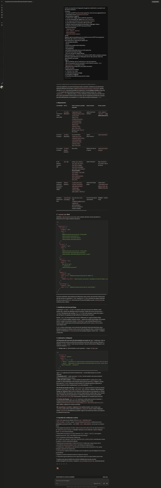

# Evidência 02 — `.mcp/mcp.json` final

## Identificação

- Exercício: Desenvolvedor 2.1 — Configuração e uso real de MCP servers no projeto
- Artefato: Configuração final de MCP
- Arquivo configurado no repo: `.mcp/mcp.json`
- Ferramenta usada para gerar/revisar: Claude chat
- Data da aplicação: 13/06/26
- Evidência associada: 

## Configuração final aplicada

```json
{
  "mcpServers": {
    "fs-code": {
      "command": "npx",
      "args": [
        "-y",
        "@modelcontextprotocol/server-filesystem",
        "/Users/fernanda.peron/Documents/repositories/dgs-ai-first/src",
        "/Users/fernanda.peron/Documents/repositories/dgs-ai-first/specs",
        "/Users/fernanda.peron/Documents/repositories/dgs-ai-first/skills"
      ]
    },
    "fs-docs": {
      "command": "npx",
      "args": [
        "-y",
        "@modelcontextprotocol/server-filesystem",
        "/Users/fernanda.peron/Documents/repositories/dgs-ai-first/docs/novatech",
        "/Users/fernanda.peron/Documents/repositories/dgs-ai-first/data/retrieval-corpus"
      ]
    },
    "git": {
      "command": "uvx",
      "args": [
        "mcp-server-git",
        "--repository",
        "/Users/fernanda.peron/Documents/repositories/dgs-ai-first"
      ]
    },
    "memory": {
      "command": "npx",
      "args": ["-y", "@modelcontextprotocol/server-memory"],
      "env": {
        "MEMORY_FILE_PATH": "/Users/fernanda.peron/Documents/repositories/dgs-ai-first/.mcp/memory/novatech-memory.json"
      }
    },
    "everything": {
      "command": "npx",
      "args": ["-y", "@modelcontextprotocol/server-everything"]
    }
  }
}
```

## Justificativa por server

| Server | Comando | Escopo | Permissão pretendida | Por que é mínimo suficiente? | Observações |
|---|---|---|---|---|---|
| `fs-code` | `npx -y @modelcontextprotocol/server-filesystem` | `src/`, `specs/`, `skills/` | Leitura/escrita | São as únicas pastas onde o agente precisa produzir código, specs e skills no exercício. | `.mcp/`, `.env`, `.git`, `node_modules` e raiz do repo ficam fora do escopo para evitar ampliação de privilégio. |
| `fs-docs` | `npx -y @modelcontextprotocol/server-filesystem` | `docs/novatech/`, `data/retrieval-corpus/` | Leitura por política/intenção | São as fontes de negócio e chunks necessários para consulta e evidência de retrieval, sem necessidade de escrita. | Via `npx`, o filesystem server não impõe read-only determinístico; mitigação recomendada: Docker bind mount `ro`, permissões do SO ou filtro de tools no cliente. |
| `git` | `uvx mcp-server-git --repository` | Raiz atual do projeto (`dgs-ai-first`) | Leitura por política/intenção | O server precisa da raiz do repositório para consultar branch, log, status e diff. | Evitar tools de escrita como commit, add, reset, checkout e criação de branch durante este exercício. |
| `memory` | `npx -y @modelcontextprotocol/server-memory` | `.mcp/memory/novatech-memory.json` | Leitura/escrita no arquivo de memória | A memória fica confinada em um arquivo dedicado para decisões e linguagem ubíqua do projeto. | O arquivo de memória não fica dentro dos escopos de `fs-code` nem `fs-docs`, reduzindo manipulação acidental como arquivo comum. |
| `everything` | `npx -y @modelcontextprotocol/server-everything` | Nenhum escopo de projeto | Uso didático/sandbox | Serve apenas para explorar primitivas MCP, sem acesso a código, docs, corpus ou Git. | Deve ficar desligado fora de sessões de aprendizado, pois tools demonstrativas podem expor ambiente ou acionar recursos desnecessários. |

## Diferenças em relação ao scaffold/exemplo

- O exemplo original usava um único `filesystem` com `./src`, `./specs`, `./skills`, `./docs` e `./data`; a configuração final separa `fs-code` e `fs-docs` para reduzir o raio de impacto.
- `fs-code` aponta somente para `src/`, `specs/` e `skills/`, que são as áreas de autoria do agente.
- `fs-docs` aponta somente para `docs/novatech/` e `data/retrieval-corpus/`, que são fontes de consulta para documentação e chunks.
- `.mcp/` não foi incluído no filesystem para impedir que o agente altere a própria configuração MCP via filesystem.
- Os caminhos relativos do scaffold foram substituídos por caminhos absolutos reais, conforme exigência do `server-filesystem`.
- O `memory` recebeu `MEMORY_FILE_PATH` explícito para manter a memória persistente em um arquivo controlado do projeto.
- A pasta `.mcp/memory/` foi preparada com `.gitkeep`, e `.mcp/memory/*.json` foi adicionado ao `.gitignore` para evitar versionar a memória local gerada pelo server.

## Adaptação para VS Code/Copilot

Durante a execução real, o VS Code/Copilot não carregou os servers a partir de `.mcp/mcp.json`. Para ativar os MCPs no cliente usado no exercício, foi necessário criar também `.vscode/mcp.json`, com a mesma arquitetura de servers, mas no formato esperado pelo VS Code:

- chave raiz `servers` em vez de `mcpServers`;
- `type: "stdio"` em cada server;
- `${workspaceFolder}` no lugar de caminhos absolutos, para funcionar quando o projeto for aberto em outro caminho local.

Essa duplicação não muda a arquitetura de MCP do projeto. O `.mcp/mcp.json` permanece como configuração canônica/documental do exercício, alinhada ao scaffold do Anexo C. O `.vscode/mcp.json` é a adaptação operacional do cliente VS Code/Copilot para conseguir executar os mesmos servers e coletar as evidências reais.

Conteúdo aplicado em `.vscode/mcp.json`:

```json
{
  "servers": {
    "fs-code": {
      "type": "stdio",
      "command": "npx",
      "args": [
        "-y",
        "@modelcontextprotocol/server-filesystem",
        "${workspaceFolder}/src",
        "${workspaceFolder}/specs",
        "${workspaceFolder}/skills"
      ]
    },
    "fs-docs": {
      "type": "stdio",
      "command": "npx",
      "args": [
        "-y",
        "@modelcontextprotocol/server-filesystem",
        "${workspaceFolder}/docs/novatech",
        "${workspaceFolder}/data/retrieval-corpus"
      ]
    },
    "git": {
      "type": "stdio",
      "command": "uvx",
      "args": [
        "mcp-server-git",
        "--repository",
        "${workspaceFolder}"
      ]
    },
    "memory": {
      "type": "stdio",
      "command": "npx",
      "args": ["-y", "@modelcontextprotocol/server-memory"],
      "env": {
        "MEMORY_FILE_PATH": "${workspaceFolder}/.mcp/memory/novatech-memory.json"
      }
    },
    "everything": {
      "type": "stdio",
      "command": "npx",
      "args": ["-y", "@modelcontextprotocol/server-everything"]
    }
  }
}
```

Critério de consistência adotado: qualquer mudança de server, escopo ou permissão deve ser refletida nos dois arquivos enquanto o cliente exigir formatos diferentes.

## Checklist de aceite

- [x] O JSON é válido.
- [x] A configuração está aplicada em `.mcp/mcp.json`.
- [x] Todos os servers são locais e gratuitos.
- [x] O filesystem não inclui `.env`, `node_modules`, home do usuário ou workspace inteiro.
- [x] A documentação NovaTech e o corpus RAG não estão misturados com escopo amplo desnecessário.
- [x] As limitações de read-only foram explicadas quando aplicável.
- [x] A adaptação `.vscode/mcp.json` foi registrada como requisito operacional do VS Code/Copilot.
