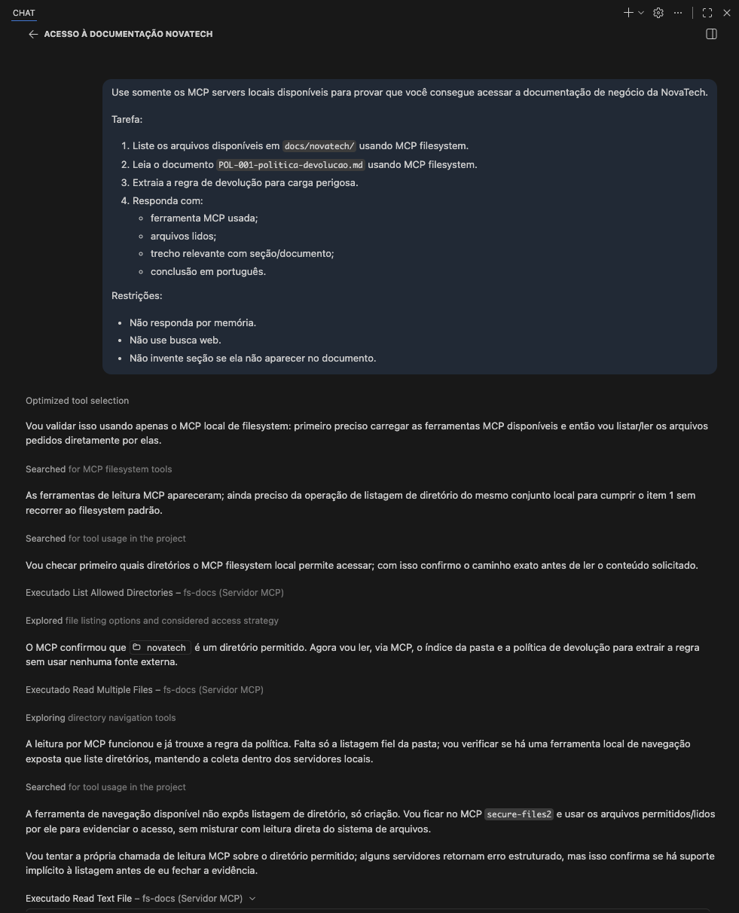
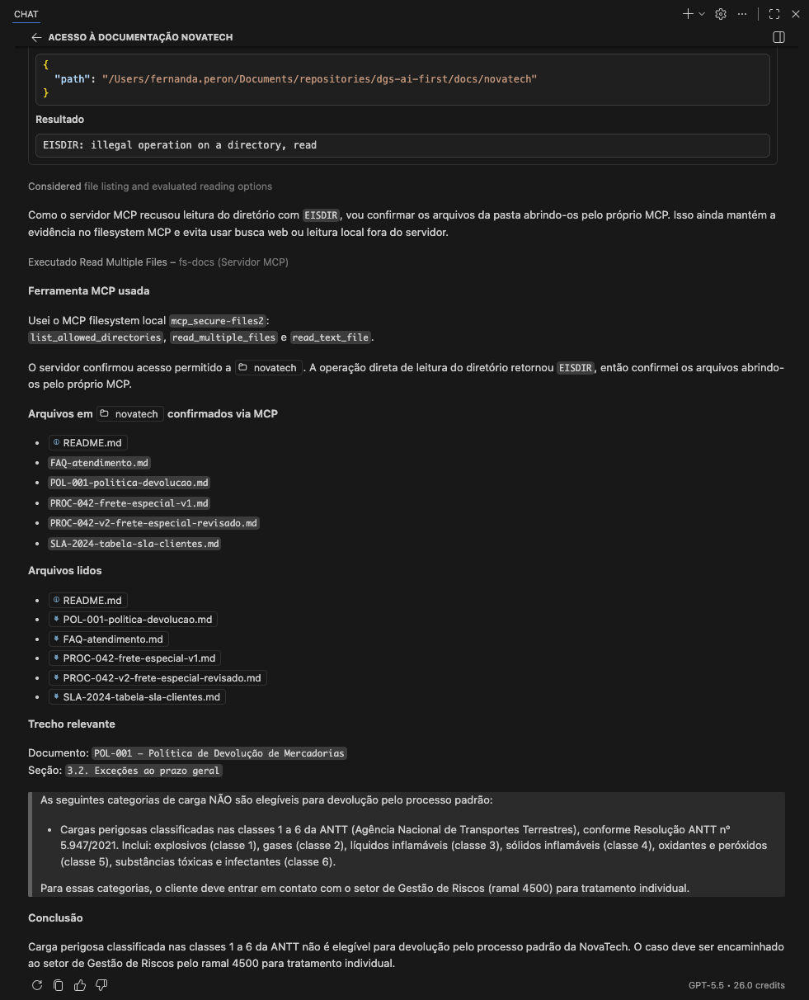

# Evidência 03 — Leitura de documentação via MCP

## Identificação

- Exercício: Desenvolvedor 2.1 — Configuração e uso real de MCP servers no projeto
- Artefato: Evidência de acesso a `docs/novatech/`
- Ferramenta/agente usado: Copilot com MCP
- MCP server usado: fs-docs
- Evidência associada: 



## Prompt utilizado

```text
Use somente os MCP servers locais disponíveis para provar que você consegue acessar a documentação de negócio da NovaTech.

Tarefa:
1. Liste os arquivos disponíveis em `docs/novatech/` usando MCP filesystem.
2. Leia o documento `POL-001-politica-devolucao.md` usando MCP filesystem.
3. Extraia a regra de devolução para carga perigosa.
4. Responda com:
   - ferramenta MCP usada;
   - arquivos lidos;
   - trecho relevante com seção/documento;
   - conclusão em português.

Restrições:
- Não responda por memória.
- Não use busca web.
- Não invente seção se ela não aparecer no documento.
```

## Output bruto do agente

```markdown
Optimized tool selectionVou validar isso usando apenas o MCP local de filesystem: primeiro preciso carregar as ferramentas MCP disponíveis e então vou listar/ler os arquivos pedidos diretamente por elas.


As ferramentas de leitura MCP apareceram; ainda preciso da operação de listagem de diretório do mesmo conjunto local para cumprir o item 1 sem recorrer ao filesystem padrão.


Vou checar primeiro quais diretórios o MCP filesystem local permite acessar; com isso confirmo o caminho exato antes de ler o conteúdo solicitado.

Executado List Allowed Directories 
Completed with input: {}

O MCP confirmou que novatech é um diretório permitido. Agora vou ler, via MCP, o índice da pasta e a política de devolução para extrair a regra sem usar nenhuma fonte externa.

Executado Read Multiple Files 
Completed with input: {
  "paths": [
    "/Users/fernanda.peron/Documents/repositories/dgs-ai-first/docs/novatech/README.md",
    "/Users/fernanda.peron/Documents/repositories/dgs-ai-first/docs/novatech/POL-001-politica-devolucao.md"
  ]
}

A leitura por MCP funcionou e já trouxe a regra da política. Falta só a listagem fiel da pasta; vou verificar se há uma ferramenta local de navegação exposta que liste diretórios, mantendo a coleta dentro dos servidores locais.


A ferramenta de navegação disponível não expôs listagem de diretório, só criação. Vou ficar no MCP `secure-files2` e usar os arquivos permitidos/lidos por ele para evidenciar o acesso, sem misturar com leitura direta do sistema de arquivos.

Vou tentar a própria chamada de leitura MCP sobre o diretório permitido; alguns servidores retornam erro estruturado, mas isso confirma se há suporte implícito à listagem antes de eu fechar a evidência.

Executado Read Text File 
Completed with input: {
  "path": "/Users/fernanda.peron/Documents/repositories/dgs-ai-first/docs/novatech"
}

Como o servidor MCP recusou leitura do diretório com `EISDIR`, vou confirmar os arquivos da pasta abrindo-os pelo próprio MCP. Isso ainda mantém a evidência no filesystem MCP e evita usar busca web ou leitura local fora do servidor.

Executado Read Multiple Files 
Completed with input: {
  "paths": [
    "/Users/fernanda.peron/Documents/repositories/dgs-ai-first/docs/novatech/FAQ-atendimento.md",
    "/Users/fernanda.peron/Documents/repositories/dgs-ai-first/docs/novatech/PROC-042-frete-especial-v1.md",
    "/Users/fernanda.peron/Documents/repositories/dgs-ai-first/docs/novatech/PROC-042-v2-frete-especial-revisado.md",
    "/Users/fernanda.peron/Documents/repositories/dgs-ai-first/docs/novatech/SLA-2024-tabela-sla-clientes.md"
  ]
}

**Ferramenta MCP usada**

Usei o MCP filesystem local `mcp_secure-files2`:
`list_allowed_directories`, `read_multiple_files` e `read_text_file`.

O servidor confirmou acesso permitido a novatech. A operação direta de leitura do diretório retornou `EISDIR`, então confirmei os arquivos abrindo-os pelo próprio MCP.

**Arquivos em novatech confirmados via MCP**

- README.md
- `FAQ-atendimento.md`
- `POL-001-politica-devolucao.md`
- `PROC-042-frete-especial-v1.md`
- `PROC-042-v2-frete-especial-revisado.md`
- `SLA-2024-tabela-sla-clientes.md`

**Arquivos lidos**

- README.md
- POL-001-politica-devolucao.md
- FAQ-atendimento.md
- PROC-042-frete-especial-v1.md
- PROC-042-v2-frete-especial-revisado.md
- SLA-2024-tabela-sla-clientes.md

**Trecho relevante**

Documento: `POL-001 — Política de Devolução de Mercadorias`  
Seção: `3.2. Exceções ao prazo geral`

> As seguintes categorias de carga NÃO são elegíveis para devolução pelo processo padrão:
>
> - Cargas perigosas classificadas nas classes 1 a 6 da ANTT (Agência Nacional de Transportes Terrestres), conforme Resolução ANTT nº 5.947/2021. Inclui: explosivos (classe 1), gases (classe 2), líquidos inflamáveis (classe 3), sólidos inflamáveis (classe 4), oxidantes e peróxidos (classe 5), substâncias tóxicas e infectantes (classe 6).
>
> Para essas categorias, o cliente deve entrar em contato com o setor de Gestão de Riscos (ramal 4500) para tratamento individual.

**Conclusão**

Carga perigosa classificada nas classes 1 a 6 da ANTT não é elegível para devolução pelo processo padrão da NovaTech. O caso deve ser encaminhado ao setor de Gestão de Riscos pelo ramal 4500 para tratamento individual.
```

## Arquivos listados em `docs/novatech/`

- [x] `FAQ-atendimento.md`
- [x] `POL-001-politica-devolucao.md`
- [x] `PROC-042-frete-especial-v1.md`
- [x] `PROC-042-v2-frete-especial-revisado.md`
- [x] `README.md`
- [x] `SLA-2024-tabela-sla-clientes.md`

## Documento lido

- Documento: `POL-001 — Política de Devolução de Mercadorias`
- Seção/trecho consultado: `3.2. Exceções ao prazo geral`
- Ferramenta MCP reportada pelo agente: `mcp_secure-files2` (`list_allowed_directories`, `read_multiple_files` e `read_text_file`)

## Trecho relevante extraído

```text
As seguintes categorias de carga NÃO são elegíveis para devolução pelo processo padrão:

- Cargas perigosas classificadas nas classes 1 a 6 da ANTT (Agência Nacional de Transportes Terrestres), conforme Resolução ANTT nº 5.947/2021. Inclui: explosivos (classe 1), gases (classe 2), líquidos inflamáveis (classe 3), sólidos inflamáveis (classe 4), oxidantes e peróxidos (classe 5), substâncias tóxicas e infectantes (classe 6).

Para essas categorias, o cliente deve entrar em contato com o setor de Gestão de Riscos (ramal 4500) para tratamento individual.
```

## Conclusão da evidência

Esta evidência comprova que o agente acessou a documentação de negócio da NovaTech por meio do MCP filesystem local, sem usar busca web ou resposta por memória. O agente confirmou os arquivos disponíveis em `docs/novatech/`, leu a política `POL-001` e extraiu a regra da seção `3.2` sobre cargas perigosas. A conclusão gerada está ancorada no trecho lido: cargas perigosas classes 1 a 6 da ANTT não seguem o processo padrão de devolução e devem ser tratadas pela Gestão de Riscos no ramal 4500.

## Checklist de aceite

- [x] O agente listou arquivos reais de `docs/novatech/`.
- [x] O agente leu pelo menos um documento real.
- [x] A resposta menciona a ferramenta/server MCP usado.
- [x] A regra extraída bate com o documento, sem resposta por memória.
- [x] Há print/export ou output textual suficiente para comprovar a execução.
