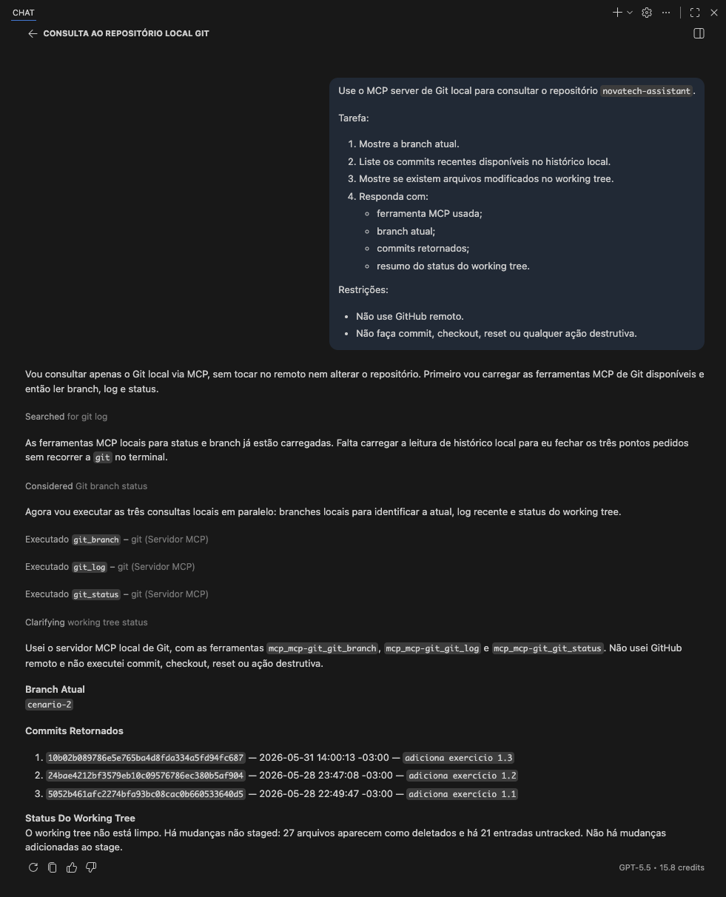

# Evidência 05 — Consulta ao Git via MCP

## Identificação

- Exercício: Desenvolvedor 2.1 — Configuração e uso real de MCP servers no projeto
- Artefato: Evidência de acesso ao histórico/estado do Git local
- Ferramenta/agente usado: Copilot com MCP
- MCP server usado: `git`
- Repositório consultado: `dgs-ai-first` (`/Users/fernanda.peron/Documents/repositories/dgs-ai-first`)
- Evidência associada: 

## Prompt utilizado

```text
Use o MCP server de Git local para consultar o repositório `novatech-assistant`.

Tarefa:
1. Mostre a branch atual.
2. Liste os commits recentes disponíveis no histórico local.
3. Mostre se existem arquivos modificados no working tree.
4. Responda com:
   - ferramenta MCP usada;
   - branch atual;
   - commits retornados;
   - resumo do status do working tree.

Restrições:
- Não use GitHub remoto.
- Não faça commit, checkout, reset ou qualquer ação destrutiva.
```

## Output bruto do agente

```markdown
Vou consultar apenas o Git local via MCP, sem tocar no remoto nem alterar o repositório. Primeiro vou carregar as ferramentas MCP de Git disponíveis e então ler branch, log e status.


As ferramentas MCP locais para status e branch já estão carregadas. Falta carregar a leitura de histórico local para eu fechar os três pontos pedidos sem recorrer a `git` no terminal.


Agora vou executar as três consultas locais em paralelo: branches locais para identificar a atual, log recente e status do working tree.

Executado `git_branch` 
Completed with input: {
  "repo_path": "/Users/fernanda.peron/Documents/repositories/dgs-ai-first",
  "branch_type": "local"
}

Executado `git_log` 
Completed with input: {
  "repo_path": "/Users/fernanda.peron/Documents/repositories/dgs-ai-first",
  "max_count": 10
}

Executado `git_status` 
Completed with input: {
  "repo_path": "/Users/fernanda.peron/Documents/repositories/dgs-ai-first"
}

Usei o servidor MCP local de Git, com as ferramentas `mcp_mcp-git_git_branch`, `mcp_mcp-git_git_log` e `mcp_mcp-git_git_status`. Não usei GitHub remoto e não executei commit, checkout, reset ou ação destrutiva.

**Branch Atual**
`cenario-2`

**Commits Retornados**
1. `10b02b089786e5e765ba4d8fda334a5fd94fc687` — 2026-05-31 14:00:13 -03:00 — `adiciona exercicio 1.3`
2. `24bae4212bf3579eb10c09576786ec380b5af904` — 2026-05-28 23:47:08 -03:00 — `adiciona exercício 1.2`
3. `5052b461afc2274bfa93bc08cac0b660533640d5` — 2026-05-28 22:49:47 -03:00 — `adiciona exercício 1.1`

**Status Do Working Tree**
O working tree não está limpo. Há mudanças não staged: 27 arquivos aparecem como deletados e há 21 entradas untracked. Não há mudanças adicionadas ao stage.
```

## Resultado estruturado

- Branch atual: `cenario-2`
- Commits recentes retornados:
  - `10b02b0` — `adiciona exercicio 1.3`
  - `24bae42` — `adiciona exercício 1.2`
  - `5052b46` — `adiciona exercício 1.1`
- Status do working tree: com alterações; há 27 arquivos deletados em mudanças não staged e 21 entradas untracked; não há mudanças adicionadas ao stage.
- Ferramenta MCP reportada pelo agente: `mcp_mcp-git_git_branch`, `mcp_mcp-git_git_log` e `mcp_mcp-git_git_status`

## Ações não realizadas

Confirme que a consulta foi somente leitura.

- [x] Não fez commit.
- [x] Não fez checkout.
- [x] Não fez reset.
- [x] Não fez push/pull remoto.
- [x] Não alterou arquivos durante a consulta.

## Conclusão da evidência

Esta evidência comprova que o agente consultou o Git local via MCP, usando ferramentas específicas para branch, histórico e status. A branch atual foi identificada como `cenario-2`, os commits recentes foram retornados a partir do histórico local e o estado do working tree foi reportado sem depender de GitHub remoto. A execução também registrou que não houve commit, checkout, reset ou qualquer ação destrutiva.

## Checklist de aceite

- [x] O agente consultou o Git local via MCP.
- [x] A branch atual foi identificada.
- [x] Há commits recentes ou indicação clara de histórico disponível/indisponível.
- [x] O status do working tree foi reportado.
- [x] A evidência não depende de GitHub remoto.
