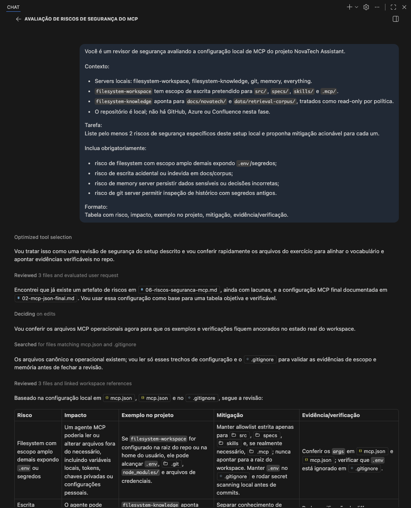

# Evidência 06 — Riscos de segurança dos MCP servers locais

## Identificação

- Exercício: Desenvolvedor 2.1 — Configuração e uso real de MCP servers no projeto
- Artefato: Análise de riscos e mitigações
- Ferramenta usada: Copilot
- Evidência associada: 

## Prompt utilizado

```text
Você é um revisor de segurança avaliando a configuração local de MCP do projeto NovaTech Assistant.

Contexto:
- Servers locais: filesystem-workspace, filesystem-knowledge, git, memory, everything.
- `filesystem-workspace` tem escopo de escrita pretendido para `src/`, `specs/`, `skills/` e `.mcp/`.
- `filesystem-knowledge` aponta para `docs/novatech/` e `data/retrieval-corpus/`, tratados como read-only por política.
- O repositório é local; não há GitHub, Azure ou Confluence nesta fase.

Tarefa:
Liste pelo menos 2 riscos de segurança específicos deste setup local e proponha mitigação acionável para cada um.

Inclua obrigatoriamente:
- risco de filesystem com escopo amplo demais expondo `.env`/segredos;
- risco de escrita acidental ou indevida em docs/corpus;
- risco de memory server persistir dados sensíveis ou decisões incorretas;
- risco de git server permitir inspeção de histórico com segredos antigos.

Formato:
Tabela com risco, impacto, exemplo no projeto, mitigação, evidência/verificação.
```

## Output bruto da IA

```markdown
Optimized tool selectionVou tratar isso como uma revisão de segurança do setup descrito e vou conferir rapidamente os arquivos do exercício para alinhar o vocabulário e apontar evidências verificáveis no repo.

Read [](file:///Users/fernanda.peron/Documents/repositories/dgs-ai-first/pratica-2/exercicio-2-fase-estruturacao.md#1-1), lines 1 to 220

Read [](file:///Users/fernanda.peron/Documents/repositories/dgs-ai-first/exercicio-2.1/06-riscos-seguranca-mcp.md)

Read [](file:///Users/fernanda.peron/Documents/repositories/dgs-ai-first/exercicio-2.1/02-mcp-json-final.md)

Encontrei que já existe um artefato de riscos em 06-riscos-seguranca-mcp.md, ainda com lacunas, e a configuração MCP final documentada em 02-mcp-json-final.md. Vou usar essa configuração como base para uma tabela objetiva e verificável.

Vou conferir os arquivos MCP operacionais agora para que os exemplos e verificações fiquem ancorados no estado real do workspace.

Searched for files matching `**/.mcp/mcp.json`, 1 match

Searched for files matching `**/.vscode/mcp.json`, 1 match

Searched for files matching `**/.gitignore`, 1 match

Os arquivos canônico e operacional existem; vou ler só esses trechos de configuração e o .gitignore para validar as evidências de escopo e memória antes de fechar a revisão.

Read [](file:///Users/fernanda.peron/Documents/repositories/dgs-ai-first/.mcp/mcp.json)

Read [](file:///Users/fernanda.peron/Documents/repositories/dgs-ai-first/.vscode/mcp.json)

Read [](file:///Users/fernanda.peron/Documents/repositories/dgs-ai-first/.gitignore)

Baseado na configuração local em mcp.json, mcp.json e no .gitignore, segue a revisão:

| Risco | Impacto | Exemplo no projeto | Mitigação | Evidência/verificação |
|---|---|---|---|---|
| Filesystem com escopo amplo demais expondo `.env` ou segredos | Um agente MCP poderia ler ou alterar arquivos fora do necessário, incluindo variáveis locais, tokens, chaves privadas ou configurações pessoais. | Se `filesystem-workspace` for configurado na raiz do repo ou na home do usuário, ele pode alcançar `.env`, .git, `node_modules/` e arquivos de credenciais. | Manter allowlist estrita apenas para src, specs, skills e, se realmente necessário, .mcp; nunca apontar para a raiz do workspace. Manter `.env` no .gitignore e rodar secret scanning local antes de commits. | Conferir os `args` em mcp.json e mcp.json; verificar que `.env` está ignorado em .gitignore. |
| Escrita acidental ou indevida em docs/corpus tratados como fonte de verdade | O agente pode alterar documentação oficial ou chunks de RAG, contaminando a base usada para respostas e testes. | `filesystem-knowledge` aponta para novatech e retrieval-corpus; se o server filesystem não impuser read-only, um prompt mal formulado pode editar política de devolução, SLA ou chunks. | Separar conhecimento de código, montar essas pastas como read-only quando possível, restringir tools de escrita no cliente MCP e exigir revisão humana de qualquer diff em docs/corpus. | Rodar verificação de diff antes/depois: `git diff -- docs/novatech data/retrieval-corpus`; conferir que `fs-docs` está separado de `fs-code` em mcp.json. |
| Memory server persistir dados sensíveis ou decisões incorretas | Informações sensíveis ou regras ainda não aprovadas podem reaparecer em sessões futuras, influenciando respostas e artefatos. | `memory` grava em `.mcp/memory/novatech-memory.json`; ele poderia persistir CPF, e-mail, token, dados de cliente ou uma decisão de domínio não validada pelo time. | Definir política de memória: não gravar segredos, PII ou hipóteses; persistir apenas decisões aprovadas, linguagem ubíqua e padrões validados. Revisar e limpar a memória periodicamente. | Conferir que `.mcp/memory/*.json` está ignorado em .gitignore; revisar o arquivo de memória local e buscar padrões sensíveis antes de compartilhar logs ou evidências. |
| Git server permitir inspeção de histórico com segredos antigos | Mesmo que um segredo tenha sido removido do estado atual, ele pode continuar acessível no histórico Git. | O server `git` opera sobre a raiz do repositório local; um agente pode consultar commits antigos, diffs e blobs que contenham tokens ou credenciais removidas. | Tratar histórico Git como dado sensível; não colar diffs brutos em chats externos; executar secret scanning no histórico; se houver segredo real, rotacionar imediatamente e remover do histórico quando aplicável. | Verificar histórico com ferramentas locais de secret scanning; revisar comandos como `git log --all -- .env` e buscas controladas no histórico, sem expor o valor do segredo no relatório. |
| Inclusão de .mcp no escopo de escrita permitir alteração da própria configuração | Um agente pode mudar servers, ampliar escopos ou alterar arquivos de memória/configuração, criando escalada de permissões local. | Se `filesystem-workspace` incluir .mcp, um prompt poderia editar mcp.json para adicionar a raiz do repo, home do usuário ou outro diretório sensível. | Preferir não incluir .mcp no filesystem de escrita geral. Se for necessário, separar em um server/admin profile, exigir aprovação humana e revisar todo diff de .mcp e .vscode. | Conferir `git diff -- .mcp .vscode`; validar que mudanças em mcp.json e mcp.json não ampliam escopo. |
| Server `everything` habilitado sem necessidade operacional | Tools demonstrativas podem ampliar a superfície de teste, gerar comportamento inesperado ou confundir agentes durante execução real. | O server `everything` está configurado localmente para aprendizado/sandbox, mas não é necessário para consultar código, docs, memória ou Git. | Desabilitar `everything` fora de sessões didáticas; manter ativo apenas quando o objetivo for estudar primitivas MCP. | Verificar presença do server em mcp.json e mcp.json; remover ou comentar no perfil usado para trabalho normal. |
```

## Riscos aprovados para entrega

| ID | Risco | Impacto | Exemplo neste projeto | Mitigação acionável | Como verificar |
|---|---|---|---|---|---|
| R-01 | Filesystem com escopo amplo demais expõe segredos ou arquivos pessoais | Um agente poderia ler ou alterar arquivos fora da necessidade do exercício, incluindo `.env`, credenciais locais, histórico Git ou arquivos pessoais. | Se o filesystem apontasse para a raiz do projeto, home do usuário ou workspace inteiro, alcançaria `.env`, `.git`, `node_modules/` e arquivos sem relação com o MCP. | Manter allowlist estrita: `fs-code` somente para `src/`, `specs/`, `skills/`; `fs-docs` somente para `docs/novatech/` e `data/retrieval-corpus/`. Não incluir home, raiz ampla, `.git`, `.env` ou `node_modules`. | Conferir os `args` em `.mcp/mcp.json` e `.vscode/mcp.json`; confirmar que `.env` e `.mcp/memory/*.json` estão no `.gitignore`. |
| R-02 | Escrita acidental em documentos/corpus que deveriam ser fonte de verdade | O agente poderia contaminar a documentação oficial ou os chunks de RAG, levando a respostas incorretas e testes enviesados. | Alteração indevida em `docs/novatech/POL-001-politica-devolucao.md` ou `data/retrieval-corpus/chunks-novatech.md` durante uma sessão de prompt. | Manter `fs-docs` separado de `fs-code`, tratar `docs/novatech/` e `data/retrieval-corpus/` como read-only por política, restringir tools de escrita quando o cliente permitir e revisar diff antes/depois. | Rodar `git diff -- docs/novatech data/retrieval-corpus`; conferir que `fs-docs` está separado de `fs-code` nas configs MCP. |
| R-03 | Memory server persistir dado sensível ou decisão incorreta | Dados sensíveis, hipóteses não aprovadas ou regras incorretas podem reaparecer em sessões futuras e influenciar artefatos gerados por IA. | `memory` grava em `.mcp/memory/novatech-memory.json`; esse arquivo poderia conter CPF, e-mail, token, decisão técnica não aprovada ou definição de domínio errada. | Definir política de memória: gravar apenas decisões aprovadas, linguagem ubíqua e padrões validados; nunca gravar segredos, PII ou hipóteses. Revisar e limpar a memória periodicamente. | Confirmar `.mcp/memory/*.json` no `.gitignore`; revisar o arquivo local de memória antes de compartilhar evidências; buscar termos sensíveis antes de qualquer commit. |
| R-04 | Git server expõe histórico com segredos antigos | Um segredo removido do estado atual pode continuar acessível em commits, diffs ou blobs antigos consultados pelo MCP Git. | O server `git` opera sobre a raiz local do repositório e pode consultar `git_log`, `git_show` e diffs históricos que eventualmente contenham credenciais removidas. | Tratar histórico Git como dado sensível, não colar diffs brutos em chats externos, usar secret scanning local quando disponível e rotacionar qualquer segredo encontrado. | Revisar histórico com comandos controlados ou ferramenta de secret scanning; registrar achados sem expor valores de segredo. |
| R-05 | Server `everything` expõe ferramentas de aprendizado desnecessárias em fluxo normal | Tools demonstrativas podem confundir o agente, aumentar superfície de execução e expor informações de ambiente se usadas fora do contexto didático. | `everything` está configurado para aprendizado de primitivas MCP, mas não é necessário para ler código, docs, corpus, memória ou Git. | Habilitar apenas em sessão de aprendizado; remover ou desabilitar no perfil usado para trabalho normal quando a evidência de estudo não for necessária. | Conferir presença do server em `.mcp/mcp.json` e `.vscode/mcp.json`; validar se ele está realmente necessário para a sessão. |
| R-06 | Inclusão de `.mcp` em escopo de escrita permitiria alteração da própria configuração | O agente poderia ampliar seus próprios privilégios, adicionando pastas sensíveis ou alterando servers sem aprovação humana. | Se `fs-code` incluísse `.mcp/`, um prompt poderia editar `.mcp/mcp.json` para incluir a raiz do projeto, home do usuário ou caminhos com segredos. | Não incluir `.mcp/` no filesystem de escrita geral; mudanças em `.mcp/mcp.json` e `.vscode/mcp.json` devem passar por revisão humana explícita. | Conferir que `fs-code` aponta apenas para `src/`, `specs/`, `skills/`; revisar `git diff -- .mcp .vscode` antes de aceitar mudanças. |

## Decisões de mitigação adotadas

- Separação de escopo em dois filesystem servers: `fs-code` para autoria em `src/`, `specs/` e `skills/`; `fs-docs` para consulta em `docs/novatech/` e `data/retrieval-corpus/`.
- `.mcp/`, `.git`, `.env`, `node_modules/` e a home do usuário ficaram fora dos escopos de filesystem configurados.
- `.mcp/memory/*.json` foi adicionado ao `.gitignore`, evitando versionamento da memória local gerada pelo `memory` server.
- `.vscode/mcp.json` foi documentado como adaptação operacional do VS Code/Copilot, mantendo os mesmos escopos da configuração canônica `.mcp/mcp.json`.
- Qualquer alteração futura em `.mcp/mcp.json`, `.vscode/mcp.json`, `docs/novatech/` ou `data/retrieval-corpus/` deve ser revisada por humano via diff antes de ser aceita como evidência ou mudança do projeto.

## Limitações aceitas

- O `@modelcontextprotocol/server-filesystem` executado via `npx` restringe diretórios permitidos, mas não impõe read-only determinístico por pasta. Mitigação aceita nesta fase: separar `fs-docs` de `fs-code`, tratar docs/corpus como read-only por política e revisar `git diff -- docs/novatech data/retrieval-corpus` após as sessões.
- O `mcp-server-git` não foi configurado com modo read-only nativo. Mitigação aceita: usar somente tools de inspeção (`git_branch`, `git_log`, `git_status`, `git_diff`) e registrar nas evidências que não houve commit, checkout, reset, push ou pull.
- O server `everything` é útil para aprendizado, mas não é necessário para o fluxo normal. Mitigação aceita: manter habilitado apenas para evidência didática e removê-lo/desabilitá-lo em um perfil de trabalho real.
- Existem dois formatos de configuração MCP no projeto: `.mcp/mcp.json` como configuração canônica do exercício e `.vscode/mcp.json` como adaptação operacional do VS Code/Copilot. Mitigação aceita: manter escopos e servers sincronizados entre os dois arquivos.

## Checklist de aceite

- [x] Há pelo menos 2 riscos específicos do setup local.
- [x] Os riscos não são genéricos; citam pastas/servers do projeto.
- [x] Cada risco tem impacto e mitigação acionável.
- [x] A análise cobre escopo amplo de filesystem.
- [x] A análise cobre escrita indevida em docs/corpus.
- [x] A análise cobre riscos de memory e/ou git.
- [x] Há uma forma objetiva de verificar cada mitigação.
