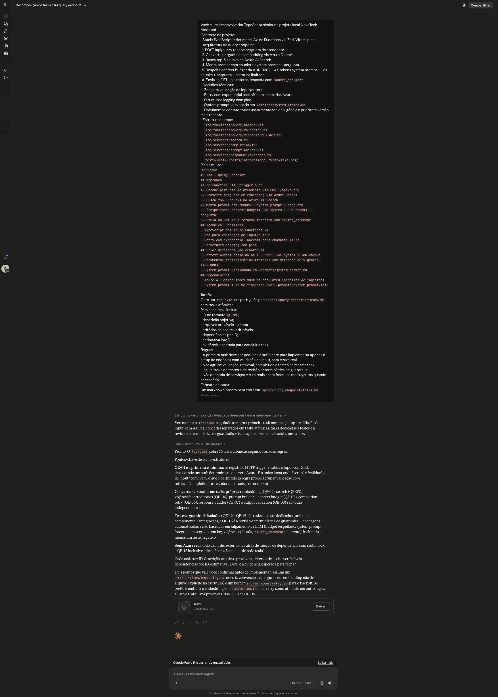

# Evidência 01 — Prompt Claude para gerar `tasks.md`

## Identificação

- Exercício: Desenvolvedor 2.2 — Implementação de spec com Spec Driven Development
- Artefato: Prompt usado para converter o plan do query endpoint em tasks atômicas
- Ferramenta usada: Claude Chat
- Evidência associada: 

## Objetivo do prompt

Gerar um `tasks.md` para `specs/query-endpoint/tasks.md`, a partir do plan simulado fornecido no enunciado, com tasks atômicas, critérios de aceite verificáveis, dependências, estimativas e evidências esperadas.

## Prompt utilizado

````text
Você é um desenvolvedor TypeScript sênior no projeto local NovaTech Assistant.

Contexto do projeto:
- Stack: TypeScript strict mode, Azure Functions v4, Zod, Vitest, pino.
- Arquitetura do query endpoint:
	1. POST /api/query recebe pergunta do atendente.
	2. Converte pergunta em embedding via Azure OpenAI.
	3. Busca top-5 chunks no Azure AI Search.
	4. Monta prompt com chunks + system prompt + pergunta.
	5. Respeita context budget da ADR-0002: ~4K tokens system prompt + ~8K chunks + pergunta + histórico limitado.
	6. Envia ao GPT-4o e retorna resposta com `source_document`.
- Decisões técnicas:
	- Zod para validação de input/output.
	- Retry com exponential backoff para chamadas Azure.
	- Structured logging com pino.
	- System prompt versionado em `/prompts/system-prompt.md`.
	- Documentos contraditórios usam metadado de vigência e priorizam versão mais recente.
- Estrutura do repo:
	- `src/functions/query/handler.ts`
	- `src/functions/query/validator.ts`
	- `src/functions/query/response-builder.ts`
	- `src/services/search.ts`
	- `src/services/completion.ts`
	- `src/services/prompt-builder.ts`
	- `src/services/response-validator.ts`
	- `tests/unit/`, `tests/integration/`, `tests/fixtures/`

Plan simulado:
```markdown
# Plan — Query Endpoint

## Approach
Azure Function HTTP trigger que:
1. Recebe pergunta do atendente via POST /api/query
2. Converte pergunta em embedding via Azure OpenAI
3. Busca top-5 chunks no Azure AI Search
4. Monta prompt com chunks + system prompt + pergunta
	 (respeitando context budget: ~4K system + ~8K chunks + pergunta)
5. Envia ao GPT-4o e retorna resposta com source_document

## Technical Decisions
- TypeScript com Azure Functions v4
- Zod para validação de input/output
- Retry com exponential backoff para chamadas Azure
- Structured logging com pino

## Prior Decisions (do cenário 1)
- Context budget definido na ADR-0002: ~4K system + ~8K chunks
- Documentos contraditórios tratados com metadado de vigência (ADR-0003)
- System prompt versionado em /prompts/system-prompt.md

## Dependencies
- Azure AI Search index must be populated (pipeline de ingestão)
- System prompt must be finalized (ver /prompts/system-prompt.md)
```

Tarefa:
Gere um `tasks.md` em português para `specs/query-endpoint/tasks.md` com tasks atômicas.

Para cada task, inclua:
- ID no formato `QE-NN`;
- descrição objetiva;
- arquivos prováveis a alterar;
- critérios de aceite verificáveis;
- dependências por ID;
- estimativa P/M/G;
- evidência esperada para concluir a task.

Regras:
- A primeira task deve ser pequena o suficiente para implementar apenas o setup do endpoint com validação de input, sem Azure real.
- Não agrupe validação, retrieval, completion e testes na mesma task.
- Inclua tasks de testes e de revisão determinística de guardrails.
- Não dependa de serviços Azure reais nesta fase; use mocks/stubs quando necessário.

Formato de saída:
Um markdown pronto para colar em `specs/query-endpoint/tasks.md`.
````

## Ajustes feitos antes de enviar

- Usei o prompt do guia como base, mantendo a estrutura do plan simulado fornecido no enunciado.
- Mantive os caminhos relativos à raiz atual do projeto (`specs/query-endpoint/tasks.md`, `src/functions/query/`, `src/services/`, `tests/`).
- Reforcei que a primeira task deveria ser pequena, sem Azure real, e focada em setup do endpoint com validação de input.
- Reforcei que as tasks deveriam ter critérios de aceite verificáveis e evidência esperada.

## Checklist de qualidade do prompt

- [x] O prompt informa a stack do projeto: TypeScript, Azure Functions v4, Zod, Vitest, pino.
- [x] O prompt inclui o plan simulado do query endpoint.
- [x] O prompt pede tasks com ID, descrição, aceite, dependências, estimativa e evidência.
- [x] O prompt restringe a primeira task ao setup do endpoint com validação de input.
- [x] O prompt proíbe dependência de Azure real nesta fase.
- [x] O prompt pede markdown pronto para `specs/query-endpoint/tasks.md`.
