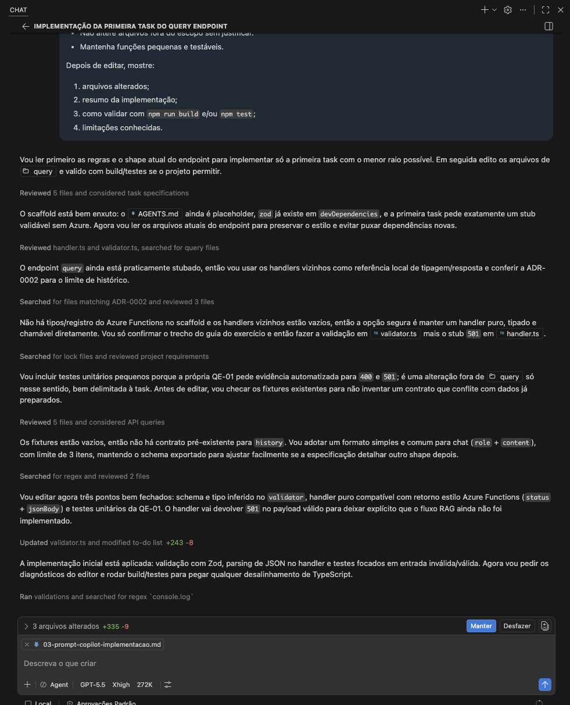

# Evidência 03 — Prompt Copilot para implementar primeira task

## Identificação

- Exercício: Desenvolvedor 2.2 — Implementação de spec com Spec Driven Development
- Artefato: Prompt usado no GitHub Copilot para implementar a primeira task
- Ferramenta usada: GitHub Copilot
- Evidência associada: 

## Task implementada

- ID da task: `QE-01`
- Título da task: Setup do endpoint HTTP + validação de input (sem Azure)
- Arquivo de tasks usado como referência: `specs/query-endpoint/tasks.md`

## Prompt utilizado

```text
Leia o `AGENTS.md`, `package.json`, `tsconfig.json`, `specs/query-endpoint/tasks.md` e os arquivos em `src/functions/query/`.

Implemente somente a primeira task do `tasks.md` do query endpoint.

Escopo esperado:
- Criar validação de input com Zod em `src/functions/query/validator.ts`.
- Atualizar `src/functions/query/handler.ts` para aceitar POST `/api/query` em Azure Functions v4 style ou, se o scaffold ainda não tiver tipos do Azure Functions instalados, manter um handler testável e tipado sem introduzir dependência nova desnecessária.
- Validar pelo menos:
  - `question`: string obrigatória, trim, mínimo 3 caracteres, máximo razoável;
  - `conversationId`: string opcional;
  - `history`: opcional, limitado a 3 turnos, conforme ADR-0002;
  - não aceitar payload vazio ou JSON inválido.
- Retornar erro 400 para input inválido em formato JSON consistente.
- Não chamar Azure OpenAI nem Azure AI Search nesta task.

Regras de implementação:
- TypeScript strict.
- Use Zod.
- Não use `console.log`.
- Não implemente tasks futuras.
- Não altere arquivos fora do escopo sem justificar.
- Mantenha funções pequenas e testáveis.

Depois de editar, mostre:
1. arquivos alterados;
2. resumo da implementação;
3. como validar com `npm run build` e/ou `npm test`;
4. limitações conhecidas.
```

## Resposta/resumo do Copilot

```markdown
Vou ler primeiro as regras e o shape atual do endpoint para implementar só a primeira task com o menor raio possível. Em seguida edito os arquivos de query e valido com build/testes se o projeto permitir.

Read [](file:///Users/fernanda.peron/Documents/repositories/dgs-ai-first/src/functions/query)

Read [](file:///Users/fernanda.peron/Documents/repositories/dgs-ai-first/AGENTS.md)

Read [](file:///Users/fernanda.peron/Documents/repositories/dgs-ai-first/package.json)

Read [](file:///Users/fernanda.peron/Documents/repositories/dgs-ai-first/tsconfig.json)

Read [](file:///Users/fernanda.peron/Documents/repositories/dgs-ai-first/specs/query-endpoint/tasks.md#1-1), lines 1 to 240

O scaffold está bem enxuto: o AGENTS.md ainda é placeholder, `zod` já existe em `devDependencies`, e a primeira task pede exatamente um stub validável sem Azure. Agora vou ler os arquivos atuais do endpoint para preservar o estilo e evitar puxar dependências novas.

Read [](file:///Users/fernanda.peron/Documents/repositories/dgs-ai-first/src/functions/query/handler.ts)

Searched for files matching `**/tests/**/*query*`, no matches

Searched for files matching `**/src/functions/**/*.{ts,js}`, 6 matches

Read [](file:///Users/fernanda.peron/Documents/repositories/dgs-ai-first/src/functions/query/validator.ts)

Read [](file:///Users/fernanda.peron/Documents/repositories/dgs-ai-first/src/functions/query/response-builder.ts)

O endpoint `query` ainda está praticamente stubado, então vou usar os handlers vizinhos como referência local de tipagem/resposta e conferir a ADR-0002 para o limite de histórico.

Searched for files matching `**/docs/adr/*0002*`, no matches

Searched for regex `ADR-0002|history|histórico|3 turnos|turnos` (`**/*.{md,ts,json}`), 50 results

Read [](file:///Users/fernanda.peron/Documents/repositories/dgs-ai-first/src/functions/feedback/validator.ts)

Read [](file:///Users/fernanda.peron/Documents/repositories/dgs-ai-first/src/functions/feedback/handler.ts)

Read [](file:///Users/fernanda.peron/Documents/repositories/dgs-ai-first/src/functions/health/handler.ts)

Não há tipos/registro do Azure Functions no scaffold e os handlers vizinhos estão vazios, então a opção segura é manter um handler puro, tipado e chamável diretamente. Vou só confirmar o trecho do guia do exercício e então fazer a validação em validator.ts mais o stub `501` em handler.ts.

Searched for files matching `**/package-lock.json`, no matches

Searched for files matching `**/pnpm-lock.yaml`, no matches

Searched for files matching `**/yarn.lock`, no matches

Searched for files matching `**/tests/**/*.ts`, 3 matches

Read [](file:///Users/fernanda.peron/Documents/repositories/dgs-ai-first/exercicio-2.2/guia-desenvolvedor.md#110-110), lines 110 to 188

4 tarefas pendentes criadas

Vou incluir testes unitários pequenos porque a própria QE-01 pede evidência automatizada para `400` e `501`; é uma alteração fora de query só nesse sentido, bem delimitada à task. Antes de editar, vou checar os fixtures existentes para não inventar um contrato que conflite com dados já preparados.

Read [](file:///Users/fernanda.peron/Documents/repositories/dgs-ai-first/tests)

Read [](file:///Users/fernanda.peron/Documents/repositories/dgs-ai-first/tests/unit)

Read [](file:///Users/fernanda.peron/Documents/repositories/dgs-ai-first/tests/fixtures/queries.ts)

Read [](file:///Users/fernanda.peron/Documents/repositories/dgs-ai-first/tests/fixtures/expected-responses.ts)

Read [](file:///Users/fernanda.peron/Documents/repositories/dgs-ai-first/tests/fixtures/chunks.ts)

Os fixtures estão vazios, então não há contrato pré-existente para `history`. Vou adotar um formato simples e comum para chat (`role` + `content`), com limite de 3 itens, mantendo o schema exportado para ajustar facilmente se a especificação detalhar outro shape depois.

Searched for regex `history|conversationId|question|source_document` (`**/specs/query-endpoint/**`), 12 results

Read [](file:///Users/fernanda.peron/Documents/repositories/dgs-ai-first/specs/query-endpoint/requirements.md)

Read [](file:///Users/fernanda.peron/Documents/repositories/dgs-ai-first/specs/query-endpoint/plan.md)

Vou editar agora três pontos bem fechados: schema e tipo inferido no `validator`, handler puro compatível com retorno estilo Azure Functions (`status` + `jsonBody`) e testes unitários da QE-01. O handler vai devolver `501` no payload válido para deixar explícito que o fluxo RAG ainda não foi implementado.

Generating patch (350 lines) in [](file:///Users/fernanda.peron/Documents/repositories/dgs-ai-first/src/functions/query/validator.ts), [](file:///Users/fernanda.peron/Documents/repositories/dgs-ai-first/src/functions/query/handler.ts), [](file:///Users/fernanda.peron/Documents/repositories/dgs-ai-first/tests/unit/query-handler.test.ts)

A implementação inicial está aplicada: validação com Zod, parsing de JSON no handler e testes focados em entrada inválida/válida. Agora vou pedir os diagnósticos do editor e rodar build/testes para pegar qualquer desalinhamento de TypeScript.

Iniciando: *Rodar validações locais* (4/4)

Checked [](file:///Users/fernanda.peron/Documents/repositories/dgs-ai-first/src/functions/query/validator.ts), [](file:///Users/fernanda.peron/Documents/repositories/dgs-ai-first/src/functions/query/handler.ts), [](file:///Users/fernanda.peron/Documents/repositories/dgs-ai-first/tests/unit/query-handler.test.ts), no problems found

Searched for regex `console\.log` (`**/src/functions/query/**`), no results

Os diagnósticos locais estão limpos e não há `console.log` no endpoint. Vou rodar `npm run build` e depois `npm test` para validar também pelo toolchain do repo.

Ran terminal command:  npm run build

O build não chegou ao TypeScript: `tsc` não está disponível porque as dependências ainda não estão instaladas neste workspace. Vou checar rapidamente se há .gitignore; se `node_modules` estiver ignorado, instalo sem gerar lockfile para conseguir validar sem mexer em artefatos versionáveis.

Checked , no problems found

Searched for files matching `**/.gitignore`, 1 match

Searched for files matching `**/.gitignore`, 1 match

Há .gitignore no repositório e os diagnósticos do editor seguem limpos. Vou confirmar o conteúdo dele antes de instalar dependências locais temporárias.

Read [](file:///Users/fernanda.peron/Documents/repositories/dgs-ai-first/.gitignore)

`node_modules/` está ignorado, então vou instalar só as dependências locais sem criar lockfile e repetir build/testes. Isso deixa a validação real acontecer sem adicionar arquivo versionável novo.

Ran terminal command:  npm install --package-lock=false

Dependências instaladas localmente; o `npm audit` apontou vulnerabilidades no grafo atual, mas não vou alterar versões porque isso sairia da QE-01. Agora vou rodar build e testes.

Ran terminal command:  npm run build

O build TypeScript passou. Falta só a suíte Vitest para confirmar os casos automatizados da task.

Ran terminal command:  npm test

Build e testes passaram. Vou conferir o estado do Git para garantir que só ficaram mudanças versionáveis da QE-01, sem artefatos de instalação ou build aparecendo no diff.


Não há ferramenta Git específica carregável para esse status, então vou usar `git status --short` direto e manter a saída filtrada.

Ran terminal command:  git status --short

O status mostra alterações/untracked já existentes fora do meu escopo (`specs/...` e pastas de exercício), então vou deixá-las intactas. Vou verificar só o diff dos arquivos que toquei para fazer a checagem final.

Ran terminal command:  git diff -- src/functions/query/handler.ts src/functions/query/validator.ts

A validação de toolchain já está boa; vou só rodar uma checagem rápida de whitespace no diff tocado, que é barata e evita sujeira trivial antes de fechar.

Ran terminal command:  git diff --check -- src/functions/query/handler.ts src/functions/query/validator.ts tests/unit/query-handler.test.ts

Concluído. Implementei somente a QE-01 do query endpoint.

**Arquivos Alterados**
- validator.ts
- handler.ts
- query-handler.test.ts

**Resumo**
- Criei schema Zod exportado com tipo inferido para o input do `POST /api/query`.
- Validação cobre `question` obrigatória com `trim`, mínimo de 3 e máximo de 1000 caracteres.
- `conversationId` é opcional, string e normalizado com `trim`.
- `history` é opcional, limitado a 3 turnos, usando itens `{ role, content }`.
- O handler ficou testável e tipado sem importar `@azure/functions`, porque o scaffold local ainda não tem tipos/configuração Azure Functions v4.
- Payload vazio, JSON inválido e input inválido retornam `400` com JSON estável.
- Payload válido retorna `501` com `echo` normalizado, sem chamar Azure OpenAI nem Azure AI Search.

**Validação**
- Rodei `npm run build`: passou.
- Rodei `npm test`: passou, com 6 testes em query-handler.test.ts.
- Antes disso, precisei rodar `npm install --package-lock=false` porque `tsc` não estava instalado localmente. Isso criou apenas node_modules, que está ignorado pelo Git.

**Limitações Conhecidas**
- Não registrei HTTP trigger real em Azure Functions v4 porque não há `@azure/functions`, `host.json` ou scaffold compatível instalado.
- O retorno válido ainda é `501`, intencionalmente, porque a orquestração RAG é task futura.
- O `npm install` reportou vulnerabilidades no grafo atual de dependências, mas não alterei versões para não sair do escopo da QE-01.

Fez alterações.
```

## Arquivos que o prompt autorizava alterar

- [x] `src/functions/query/validator.ts`
- [x] `src/functions/query/handler.ts`
- [x] Outro, se justificado: `tests/unit/query-handler.test.ts`, criado para comprovar automaticamente os cenários de `400` e `501` exigidos pela QE-01.

## Restrições reforçadas no prompt

- [x] Não chamar Azure OpenAI.
- [x] Não chamar Azure AI Search.
- [x] Usar Zod.
- [x] Manter TypeScript strict.
- [x] Não usar `console.log`.
- [x] Não implementar tasks futuras.
- [x] Retornar erro 400 para input inválido.

## Checklist de aceite

- [x] O prompt enviado ao Copilot foi registrado.
- [x] O prompt referencia `AGENTS.md`, `package.json`, `tsconfig.json`, `tasks.md` e `src/functions/query/`.
- [x] O prompt limita claramente o escopo à primeira task.
- [x] O output/resumo do Copilot foi registrado.
