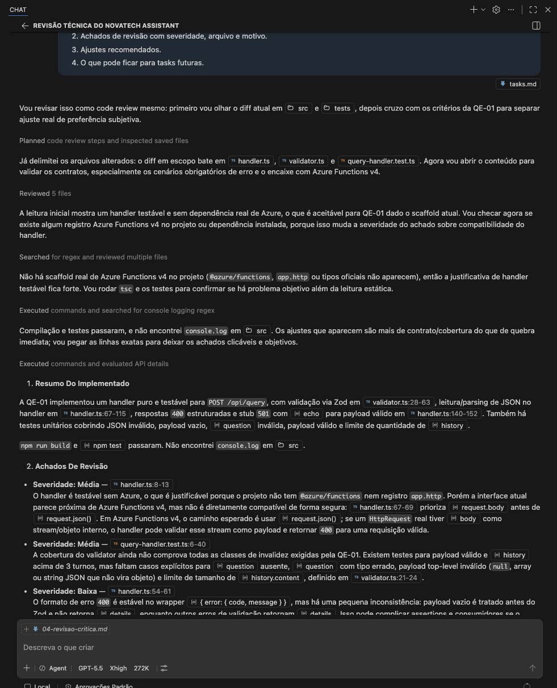

# Evidência 04 — Revisão crítica do código gerado

## Identificação

- Exercício: Desenvolvedor 2.2 — Implementação de spec com Spec Driven Development
- Artefato: Revisão crítica da implementação da primeira task
- Ferramenta usada: Copilot
- Evidência associada: 

## Prompt utilizado para revisão

```text
Atue como revisor técnico do projeto NovaTech Assistant.

Contexto:
- O Copilot acabou de implementar a primeira task do query endpoint: setup do endpoint com validação de input (QE-01 do tasks.md).
- O projeto exige TypeScript strict, Zod, Azure Functions v4, logs estruturados com pino, sem chamadas reais para Azure nesta task.
- O objetivo desta revisão é identificar pontos reais de ajuste antes de um code review, sem inventar problemas.

Tarefa:
Revise o diff da implementação relacionado à task QE-01 (src/ e tests/) e produza uma análise com pelo menos 2 pontos que precisariam ser ajustados antes de um code review real.

Verifique obrigatoriamente:
- tipos e compatibilidade com Azure Functions v4 ou justificativa para handler testável sem dependência;
- validação de JSON inválido, payload vazio e limites de `history`;
- formato de erro 400 e consistência de resposta;
- ausência de `console.log`;
- se a implementação extrapolou a primeira task;
- necessidade de testes unitários para validator/handler.

Formato:
1. Resumo do que foi implementado.
2. Achados de revisão com severidade, arquivo e motivo.
3. Ajustes recomendados.
4. O que pode ficar para tasks futuras.
```

## Output bruto da revisão

```markdown
Vou revisar isso como code review mesmo: primeiro vou olhar o diff atual em src e tests, depois cruzo com os critérios da QE-01 para separar ajuste real de preferência subjetiva.

Ran terminal command:  git status --short

Ran terminal command:  git diff -- src tests

Searched for files matching `**/src/functions/query/**`, 3 matches

Searched for files matching `**/tests/**/*query*`, 1 match

Já delimitei os arquivos alterados: o diff em escopo bate em handler.ts, validator.ts e query-handler.test.ts. Agora vou abrir o conteúdo para validar os contratos, especialmente os cenários obrigatórios de erro e o encaixe com Azure Functions v4.

Read [](file:///Users/fernanda.peron/Documents/repositories/dgs-ai-first/src/functions/query/handler.ts)

Read [](file:///Users/fernanda.peron/Documents/repositories/dgs-ai-first/src/functions/query/validator.ts)

Read [](file:///Users/fernanda.peron/Documents/repositories/dgs-ai-first/tests/unit/query-handler.test.ts)

Read [](file:///Users/fernanda.peron/Documents/repositories/dgs-ai-first/package.json)

Read [](file:///Users/fernanda.peron/Documents/repositories/dgs-ai-first/tsconfig.json)

Read [](file:///Users/fernanda.peron/Library/Application%20Support/Code/User/workspaceStorage/b4168dc1838fb5533cb34374e0a1f740/GitHub.copilot-chat/chat-session-resources/e9829092-7010-4172-a15c-01719d17dfd3/call_AOUfyjw0RGvg6KPBe8uEzQqI__vscode-1781363754990/content.txt#1-1), lines 1 to 220

A leitura inicial mostra um handler testável e sem dependência real de Azure, o que é aceitável para QE-01 dado o scaffold atual. Vou checar agora se existe algum registro Azure Functions v4 no projeto ou dependência instalada, porque isso muda a severidade do achado sobre compatibilidade do handler.

Searched for regex `@azure/functions|app\.http|HttpRequest|InvocationContext` (`**/src/**`), 3 results

Searched for files matching `**/src/functions/**`, 6 matches

Searched for files matching `**/tests/unit/**`, 1 match

Read [](file:///Users/fernanda.peron/Documents/repositories/dgs-ai-first/README.md)

Read [](file:///Users/fernanda.peron/Documents/repositories/dgs-ai-first/vitest.config.ts)

Read [](file:///Users/fernanda.peron/Documents/repositories/dgs-ai-first/src/functions/feedback/handler.ts)

Read [](file:///Users/fernanda.peron/Documents/repositories/dgs-ai-first/src/functions/health/handler.ts)

Read [](file:///Users/fernanda.peron/Documents/repositories/dgs-ai-first/src/functions/query/response-builder.ts)

Read [](file:///Users/fernanda.peron/Documents/repositories/dgs-ai-first/src/functions/feedback/validator.ts)

Não há scaffold real de Azure Functions v4 no projeto (`@azure/functions`, `app.http` ou tipos oficiais não aparecem), então a justificativa de handler testável fica forte. Vou rodar `tsc` e os testes para confirmar se há problema objetivo além da leitura estática.

Ran terminal command:  npm run build

Ran terminal command:  npm test

Searched for regex `console\.(log|debug|info|warn|error)` (`**/src/**`), no results

Compilação e testes passaram, e não encontrei `console.log` em src. Os ajustes que aparecem são mais de contrato/cobertura do que de quebra imediata; vou pegar as linhas exatas para deixar os achados clicáveis e objetivos.

Ran terminal command:  nl -ba src/functions/query/handler.ts | sed -n '1,170p'

Ran terminal command:  nl -ba src/functions/query/validator.ts | sed -n '1,130p'

Ran terminal command:  nl -ba tests/unit/query-handler.test.ts | sed -n '1,180p'

1. **Resumo Do Implementado**

A QE-01 implementou um handler puro e testável para `POST /api/query`, com validação via Zod em validator.ts, leitura/parsing de JSON no handler em handler.ts, respostas `400` estruturadas e stub `501` com `echo` para payload válido em handler.ts. Também há testes unitários cobrindo JSON inválido, payload vazio, `question` inválida, payload válido e limite de quantidade de `history`.

`npm run build` e `npm test` passaram. Não encontrei `console.log` em src.

2. **Achados De Revisão**

- **Severidade: Média** — handler.ts  
  O handler é testável sem Azure, o que é justificável porque o projeto não tem `@azure/functions` nem registro `app.http`. Porém a interface atual parece próxima de Azure Functions v4, mas não é diretamente compatível de forma segura: handler.ts prioriza `request.body` antes de `request.json()`. Em Azure Functions v4, o caminho esperado é usar `request.json()`; se um `HttpRequest` real tiver `body` como stream/objeto interno, o handler pode validar esse stream como payload e retornar `400` para uma requisição válida.

- **Severidade: Média** — query-handler.test.ts  
  A cobertura do validator ainda não comprova todas as classes de invalidez exigidas pela QE-01. Existem testes para payload válido e `history` acima de 3 turnos, mas faltam casos explícitos para `question` ausente, `question` com tipo errado, payload top-level inválido (`null`, array ou string JSON que não vira objeto) e limite de tamanho de `history.content`, definido em validator.ts.

- **Severidade: Baixa** — handler.ts  
  O formato de erro `400` é estável no wrapper `{ error: { code, message } }`, mas há uma pequena inconsistência: payload vazio é tratado antes do Zod e não retorna `details`, enquanto outros erros de validação retornam `details`. Isso pode complicar assertions e consumidores se o contrato de erro quiser sempre apontar o campo inválido.

- **Severidade: Baixa** — query-handler.test.ts  
  Os testes do handler cobrem JSON inválido usando `body: "{"`, mas não cobrem a branch Azure-adjacent em que `request.json()` rejeita, implementada em handler.ts. Se o PR defender o handler como compatível com um futuro adapter de Azure Functions v4, esse caminho deveria estar testado.

3. **Ajustes Recomendados**

- Separar melhor o contrato puro do handler do contrato Azure: manter `queryHandler` testável, mas ajustar `readJsonBody` para preferir `request.json()` quando existir, usando `body` só como fallback de teste; ou criar um adapter explícito futuro para `HttpRequest`.
- Adicionar testes unitários para `question` ausente, tipo errado, payload top-level inválido, `history.content` acima do limite e `history` acima do limite passando pelo handler.
- Padronizar o erro `400`: ou deixar todos os `INVALID_REQUEST` com `details`, inclusive payload vazio, ou documentar que erros de parsing/body não têm detalhes e erros de schema têm.
- Adicionar um teste para `request.json()` lançando erro, garantindo `400 INVALID_JSON`.

4. **Pode Ficar Para Tasks Futuras**

- Registro real do HTTP trigger Azure Functions v4, `host.json` e dependência `@azure/functions`, porque o scaffold atual não está configurado para isso.
- Logs estruturados com pino, desde que permaneça sem `console.log`; a instrumentação formal está prevista na QE-09.
- Embedding, search, prompt builder, completion, response builder final e validação de output; a implementação atual não extrapolou essas etapas.
```

## Resumo do que foi implementado

A implementação da `QE-01` criou um handler puro e testável para `POST /api/query`, sem dependência real de Azure, com validação de entrada via Zod em `src/functions/query/validator.ts`. O handler em `src/functions/query/handler.ts` faz parsing do corpo, retorna `400` para JSON inválido, payload vazio e payload fora do schema, e retorna `501` com `echo` normalizado para payload válido, deixando claro que o fluxo RAG ainda é task futura. Também foram adicionados testes unitários em `tests/unit/query-handler.test.ts` cobrindo os principais caminhos de validação. A validação local reportada passou em `npm run build` e `npm test`, e não foi encontrado `console.log` em `src/`.

## Achados de revisão aprovados para entrega

| ID | Severidade | Arquivo | Achado | Motivo | Ajuste recomendado | Status |
|---|---|---|---|---|---|---|
| REV-01 | Média | `src/functions/query/handler.ts` | Handler testável, mas compatibilidade direta com Azure Functions v4 ainda não está comprovada. | A `QE-01` permite manter um handler puro quando o scaffold Azure não existe, e este é o caso do projeto. Ainda assim, o handler se aproxima do contrato de `HttpRequest` e prioriza `request.body` antes de `request.json()`, o que deve ser revisto antes de conectá-lo a um trigger Azure real. | Manter o handler puro para esta entrega e registrar que a adaptação para Azure Functions v4 precisa preferir `request.json()` ou usar um adapter explícito. | Aceitável para a `QE-01` como limitação documentada; ajuste necessário antes de declarar compatibilidade Azure v4 direta. |
| REV-02 | Média | `tests/unit/query-handler.test.ts` | Cobertura de invalidez ainda não comprova todos os critérios de aceite da `QE-01`. | Há testes para payload válido, JSON inválido, payload vazio, `question` inválida e limite de quantidade de `history`, mas faltam casos para `question` ausente, tipo errado, payload top-level inválido (`null`, array ou string JSON que não vira objeto) e limite de `history.content`. | Adicionar testes unitários para as classes de invalidez faltantes no validator e no handler. | Pendente antes de um code review real da `QE-01`. |

## O que pode ficar para tasks futuras

- Registro real do HTTP trigger Azure Functions v4, criação/ajuste de `host.json` e inclusão de `@azure/functions`, porque o scaffold atual ainda não possui essa infraestrutura.
- Logs estruturados com pino, desde que o código permaneça sem `console.log`; a instrumentação formal está prevista na `QE-09`.
- Embedding, busca no Azure AI Search, prompt builder, completion GPT-4o, response builder final e validação de output; a implementação atual não extrapolou essas etapas e elas permanecem nas tasks `QE-02` a `QE-10`.
- Validação determinística de guardrails, incluindo orçamento de tokens, vigência, ausência de segredos em logs e rastreabilidade de `source_document`, prevista na `QE-16`.

## Checklist de revisão

- [x] Há ao menos 2 pontos reais de ajuste antes de code review.
- [x] A revisão verifica tipos e compatibilidade com Azure Functions v4 ou justifica handler testável.
- [x] A revisão verifica JSON inválido, payload vazio e limite de `history`.
- [x] A revisão verifica formato de erro 400.
- [x] A revisão verifica ausência de `console.log`.
- [x] A revisão verifica se o código extrapolou a primeira task.
- [x] A revisão menciona necessidade de testes unitários para validator/handler.
