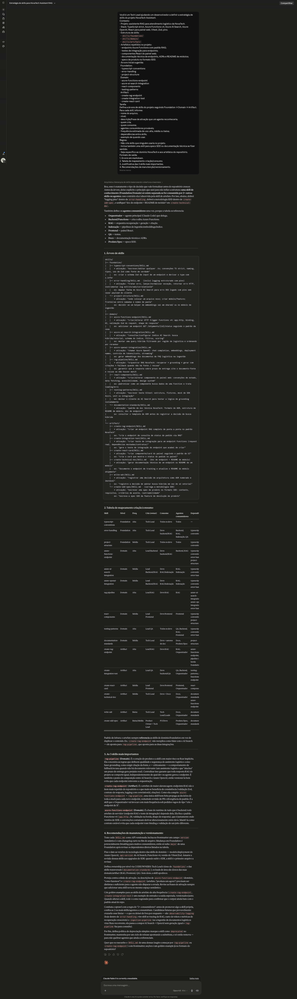

# Evidência 01 — Árvore de skills do projeto

## Identificação

- Exercício: Desenvolvedor 2.3 — Definição de estratégia de skills do projeto
- Artefato: Árvore de skills Foundation → Domain → Artifact
- Ferramenta usada: Claude
- Evidência associada: 

## Objetivo

Definir uma árvore de skills coerente com os artefatos repetidos do projeto NovaTech Assistant, evitando skills genéricas ou que ninguém consumiria.

## Prompt utilizado no Claude

```text
Você é um Tech Lead ajudando um desenvolvedor a definir a estratégia de skills do projeto NovaTech Assistant.

Contexto:
- Projeto: assistente RAG para atendimento logístico da NovaTech.
- Stack: TypeScript strict, Azure Functions v4, Azure AI Search, Azure OpenAI, React para painel web, Vitest, Zod, pino.
- Estrutura de skills:
  - `skills/foundation/`
  - `skills/domain/`
  - `skills/artifact/`
- Artefatos repetidos no projeto:
  - endpoints Azure Functions com padrão RAG;
  - testes de integração para endpoints;
  - componentes React do painel web;
  - documentação técnica de endpoints, ADRs e README de módulos;
  - specs de produto no formato SDD.
- Árvore inicial sugerida:
  Foundation:
  - typescript-conventions
  - error-handling
  - project-structure
  Domain:
  - azure-functions-endpoint
  - azure-ai-search-integration
  - react-components
  - testing-patterns
  Artifact:
  - create-rag-endpoint
  - create-integration-test
  - create-react-card

Tarefa:
Defina a árvore de skills do projeto seguindo Foundation → Domain → Artifact.

Para cada skill, informe:
- nome do arquivo;
- nível;
- descrição/frase de ativação que um agente reconheceria;
- quem cria;
- quem consome;
- agentes consumidores prováveis;
- frequência estimada de uso: alta, média ou baixa;
- dependências entre skills;
- exemplo de quando usar.

Regras:
- Não crie skills que ninguém usaria no projeto.
- Inclua também uma skill para specs SDD ou documentação técnica se fizer sentido.
- Seja específico ao domínio NovaTech e aos artefatos do repositório.

Formato de saída:
1. Árvore em markdown.
2. Tabela de mapeamento criação/consumo.
3. Justificativa das 3 skills mais importantes.
4. Recomendações de manutenção/versionamento.
```

## Output bruto do Claude

```markdown
Boa, esse é exatamente o tipo de decisão que vale formalizar antes do repositório crescer. Antes da árvore, deixo explícito o princípio que usei para não inflar a estrutura: **uma skill de conhecimento (Foundation/Domain) só existe separada se for consumida por 2+ outras skills ou agentes**; caso contrário ela é absorvida pela skill de artefato. Por isso, abaixo, dobrei "logging pino" dentro de `error-handling`, dobrei a metodologia SDD dentro de `create-sdd-spec`, e unifiquei "doc de endpoint + README de módulo" em `create-technical-doc`.

Também defino os **agentes consumidores** uma vez, porque a tabela os referencia:

- **Orquestrador** — agente principal (Claude Code) que delega.
- **Backend/Functions** — cria e edita Azure Functions.
- **RAG** — orquestra recuperação + geração + citação.
- **Indexação** — pipelines de ingestão/embeddings/índice.
- **Frontend** — painel React.
- **QA** — testes.
- **Docs** — documentação técnica e ADRs.
- **Produto/Spec** — specs SDD.

---

## 1. Árvore de skills

```
skills/
├── foundation/
│   ├── typescript-conventions/SKILL.md
│   │   → ativação: "escrever/editar qualquer .ts; convenções TS strict, naming, tipos, uso de Zod como fonte de verdade"
│   │   ex: criar o schema Zod de input de um endpoint e derivar o type com z.infer
│   ├── error-handling/SKILL.md   (inclui logging estruturado com pino)
│   │   → ativação: "tratar erro, lançar/normalizar exceção, retornar erro HTTP, instrumentar log estruturado/correlationId"
│   │   ex: mapear falha do Azure AI Search para erro 503 logado com pino sem vazar payload do cliente
│   └── project-structure/SKILL.md
│       → ativação: "onde colocar um arquivo novo; criar módulo/feature; fronteiras entre camadas e nomes de pasta"
│       ex: decidir se um helper de embeddings vai em shared/ ou no módulo de ingestão
│
├── domain/
│   ├── azure-functions-endpoint/SKILL.md
│   │   → ativação: "criar/alterar HTTP trigger Functions v4: app.http, binding, DI, validação Zod do request, shape de resposta"
│   │   ex: adicionar um endpoint GET /shipments/{id}/status seguindo o padrão da casa
│   ├── azure-ai-search-integration/SKILL.md
│   │   → ativação: "consultar/configurar índice AI Search: busca híbrida/vetorial, schema do índice, filtros, scoring"
│   │   ex: montar uma query híbrida filtrando por região de logística e ordenando por reranker
│   ├── azure-openai-integration/SKILL.md
│   │   → ativação: "chamar Azure OpenAI: chat completion, embeddings, deployment names, controle de tokens/custo, streaming"
│   │   ex: gerar embeddings dos documentos de FAQ logística na ingestão
│   ├── rag-pipeline/SKILL.md
│   │   → ativação: "orquestrar RAG NovaTech: recuperar → grounding → gerar com citações → fallback quando não há fonte / recusa"
│   │   ex: garantir que a resposta sobre prazo de entrega cite o documento-fonte e recuse se não houver match
│   ├── react-components/SKILL.md
│   │   → ativação: "criar/alterar componente do painel web: convenções de estado, data fetching, acessibilidade, design system"
│   │   ex: padronizar como um componente busca dados de uma Function e trata loading/erro
│   ├── testing-patterns/SKILL.md
│   │   → ativação: "escrever teste Vitest: estrutura, fixtures, mock de SDK Azure, unit vs integração"
│   │   ex: mockar o cliente do AI Search para testar a lógica de grounding isoladamente
│   └── documentation-standards/SKILL.md
│       → ativação: "padrão de doc técnica NovaTech: formato de ADR, estrutura de README de módulo, doc de endpoint"
│       ex: consultar o template de ADR antes de registrar a decisão de busca híbrida
│
└── artifact/
    ├── create-rag-endpoint/SKILL.md
    │   → ativação: "criar um endpoint RAG completo de ponta a ponta no padrão NovaTech"
    │   ex: "crie o endpoint de consulta de status de pedido via RAG"
    ├── create-integration-test/SKILL.md
    │   → ativação: "criar teste de integração para um endpoint Functions (request real, dependências mockadas/contratos)"
    │   ex: "gere o teste de integração do endpoint que acabei de criar"
    ├── create-react-card/SKILL.md
    │   → ativação: "criar componente/card do painel seguindo o padrão de UI"
    │   ex: "crie o card que mostra o status do pedido no painel"
    ├── create-technical-doc/SKILL.md   (doc de endpoint + README de módulo)
    │   → ativação: "gerar documentação técnica de um endpoint ou README de um módulo"
    │   ex: "documente o endpoint de tracking e atualize o README do módulo shipments"
    ├── write-adr/SKILL.md
    │   → ativação: "registrar uma decisão de arquitetura como ADR numerado e imutável"
    │   ex: "registre a decisão de adotar busca híbrida em vez de só vetorial"
    └── create-sdd-spec/SKILL.md   (carrega a metodologia SDD)
        → ativação: "escrever uma spec de produto no formato SDD: contexto, requisitos, critérios de aceite, rastreabilidade"
        ex: "escreva a spec SDD da feature de devolução de produto"
```

---

## 2. Tabela de mapeamento criação/consumo

| Skill | Nível | Freq. | Cria (owner) | Consome | Agentes consumidores | Dependências |
|---|---|---|---|---|---|---|
| typescript-conventions | Foundation | Alta | Tech Lead | Todos os devs | Todos | — |
| error-handling | Foundation | Alta | Tech Lead | Devs backend/RAG | Backend, RAG, Indexação, QA | typescript-conventions |
| project-structure | Foundation | Média | Tech Lead | Todos os devs | Todos | typescript-conventions |
| azure-functions-endpoint | Domain | Alta | Lead Backend | Devs backend/RAG | Backend, RAG | typescript-conventions, error-handling, project-structure |
| azure-ai-search-integration | Domain | Média | Lead Backend/RAG | Devs RAG/Indexação | RAG, Indexação | typescript-conventions, error-handling |
| azure-openai-integration | Domain | Média | Lead Backend/RAG | Devs RAG/Indexação | RAG, Indexação | typescript-conventions, error-handling |
| rag-pipeline | Domain | Alta | Lead RAG | Devs RAG | RAG | azure-ai-search-integration, azure-openai-integration, error-handling |
| react-components | Domain | Média | Lead Frontend | Devs frontend | Frontend | typescript-conventions, project-structure |
| testing-patterns | Domain | Alta | Lead QA | Todos os devs | QA, Backend, RAG, Frontend | typescript-conventions, error-handling |
| documentation-standards | Domain | Média | Tech Lead | Devs + autores de doc | Docs, Produto/Spec | project-structure |
| create-rag-endpoint | Artifact | Alta | Lead RAG | Devs RAG | RAG, Orquestrador | azure-functions-endpoint, rag-pipeline (→ herda foundation) |
| create-integration-test | Artifact | Alta | Lead QA | Devs backend/QA | QA, Backend, Orquestrador | testing-patterns, azure-functions-endpoint |
| create-react-card | Artifact | Média | Lead Frontend | Devs frontend | Frontend, Orquestrador | react-components |
| create-technical-doc | Artifact | Média | Tech Lead | Devs + Docs | Docs, Orquestrador | documentation-standards, azure-functions-endpoint |
| write-adr | Artifact | Baixa | Tech Lead | Tech Lead/Leads | Docs, Orquestrador | documentation-standards |
| create-sdd-spec | Artifact | Baixa/Média | Product Owner + Tech Lead | PO/Devs | Produto/Spec, Orquestrador | documentation-standards |

Padrão de leitura: o artefato sempre **referencia** as skills de domínio/foundation em vez de duplicar o conteúdo. Ex.: `create-rag-endpoint` não reexplica como falar com o AI Search — ele aponta para `rag-pipeline`, que aponta para as duas integrações.

---

## 3. As 3 skills mais importantes

**`rag-pipeline` (Domain).** É o coração do produto e a skill com maior risco se ficar implícita. Ela concentra as regras que definem qualidade e segurança do assistente logístico: como fazer grounding, como exigir citação da fonte, e — criticamente — o comportamento de fallback/recusa quando não há documento relevante (um assistente logístico que "alucina" um prazo de entrega gera prejuízo real). Centralizar isso garante que toda resposta RAG do projeto se comporte igual, independentemente de qual dev ou agente gerou o endpoint. É também o ponto de composição entre AI Search e Azure OpenAI, então versioná-la bem evita que cada endpoint reinvente a orquestração.

**`create-rag-endpoint` (Artifact).** É o artefato de maior alavancagem: endpoints RAG são o item mais repetido do repositório e o que mais se beneficia de consistência (validação Zod, contrato de resposta, logging com correlationId, citações). Como ela compõe `azure-functions-endpoint` + `rag-pipeline`, uma única skill bem feita propaga as decisões de toda a stack para cada novo endpoint, reduzindo revisão de PR e divergência de padrão. É a skill que o Orquestrador vai invocar com mais frequência sob pedidos vagos do tipo "crie o endpoint de X".

**`azure-functions-endpoint` (Domain).** É a base de runtime de tudo que é backend: todo artefato de servidor (endpoint RAG e teste de integração) depende dela. Ela fixa o padrão Functions v4 (`app.http`, DI, validação na borda, shape de resposta), que é justamente onde versões de SDK e convenções costumam derivar silenciosamente entre devs. Mantê-la como contrato estável evita que cada endpoint trate binding e validação de um jeito diferente.

---

## 4. Recomendações de manutenção e versionamento

Trate cada `SKILL.md` como API versionada: inclua no frontmatter um campo `version` (semântico) e um changelog curto no fim do arquivo. Mudança em Foundation é potencialmente *breaking* para muitos consumidores, então só suba `major` de uma Foundation após revisar os dependentes diretos listados na tabela.

Fixe e date as versões de tecnologia dentro das skills de domínio — modelo/deployment do Azure OpenAI, `api-version` do AI Search, Functions v4, versão do Vitest/Zod. Amarre a revisão dessas skills aos upgrades de SDK: quando subir o SDK, a skill é o primeiro arquivo a revisar.

Defina ownership por nível via CODEOWNERS: Tech Lead é dono de `foundation/` e das skills transversais (`documentation-standards`); os leads de área são donos das suas domain/artifact (RAG, Frontend, QA). Sem dono, a skill apodrece.

Proteja contra colisão de ativação. As descrições de `azure-functions-endpoint` (domínio, "como fazemos") e `create-rag-endpoint` (artefato, "produza um agora") precisam ser distintas o suficiente para o agente não disparar a errada. Revise as frases de ativação sempre que adicionar uma skill nova no mesmo espaço semântico.

Crie *golden examples* para as skills de artefato de alta frequência (`create-rag-endpoint`, `create-integration-test`): um exemplo de entrada e a saída esperada, versionados junto. Quando alterar a skill, rode-o como regressão para confirmar que o output ainda bate com o padrão atual do repo.

Combata o sprawl com a regra do "2+ consumidores": antes de promover algo a skill própria, confira se 2 ou mais skills/agentes a consumiriam. Candidatas futuras que provavelmente cruzarão esse limiar — e que eu deixei de fora por enquanto — são `observability-logging` (hoje dentro de `error-handling`; vire skill se tracing de RAG, custo de token e métricas de recuperação crescerem) e `ingestion-pipeline` (se a ingestão de documentos logísticos virar fluxo recorrente, ela passa a compor AI Search + OpenAI sem geração, igual o `rag-pipeline` faz para consulta).

Por fim, defina política de depreciação simples: marque a skill como `deprecated` no frontmatter, mantenha por um ciclo de release apontando a substituta, e só então remova — para não quebrar agentes que ainda a referenciam.

Quer que eu rascunhe o `SKILL.md` de uma dessas (sugiro começar por `rag-pipeline` ou `create-rag-endpoint`) com frontmatter, seções e um golden example já no formato do repositório?
```

## Árvore aprovada

A árvore aprovada mantém o princípio proposto pelo Claude: criar uma skill separada somente quando ela for consumida por 2 ou mais agentes, papéis ou skills. A adaptação humana feita aqui foi trocar o formato sugerido `nome-da-skill/SKILL.md` pelo formato real do repositório, que já organiza skills como arquivos `*.md` diretamente em `skills/foundation/`, `skills/domain/` e `skills/artifact/`.

```text
skills/
├── foundation/
│   ├── typescript-conventions.md
│   ├── error-handling.md
│   └── project-structure.md
├── domain/
│   ├── azure-functions-endpoint.md
│   ├── azure-ai-search-integration.md
│   ├── azure-openai-integration.md
│   ├── rag-pipeline.md
│   ├── react-components.md
│   ├── testing-patterns.md
│   └── documentation-standards.md
└── artifact/
    ├── create-rag-endpoint.md
    ├── create-integration-test.md
    ├── create-react-card.md
    ├── create-technical-doc.md
    ├── write-adr.md
    └── create-sdd-spec.md
```

## Análise do output do Claude

O output foi aprovado com ajustes porque cobre os artefatos repetidos do enunciado: endpoints RAG, testes de integração, componentes React, documentação técnica, ADRs e specs SDD. As skills adicionais sugeridas pelo Claude fazem sentido no domínio NovaTech:

- `azure-openai-integration.md` separa regras de embeddings, chat completion, deployment e controle de tokens, que seriam reutilizadas por query endpoint e pipeline de ingestão.
- `rag-pipeline.md` centraliza grounding, citações, fallback e recusa quando não há fonte, que são regras críticas para evitar respostas inventadas.
- `documentation-standards.md`, `create-technical-doc.md`, `write-adr.md` e `create-sdd-spec.md` cobrem explicitamente os artefatos de documentação e specs pedidos no exercício.

Não foram promovidas a skills próprias neste momento: `observability-logging`, porque logging fica dentro de `error-handling.md`, e `ingestion-pipeline`, porque ainda não aparece como artefato repetido no recorte do exercício 2.3.

## Dependências principais

| Skill | Depende de | Motivo |
|---|---|---|
| `typescript-conventions.md` | — | Base para qualquer geração TypeScript em backend, bot, pipeline e web. |
| `error-handling.md` | `typescript-conventions.md` | Padroniza erros tipados, respostas previsíveis e logging sem `console.log`. |
| `project-structure.md` | `typescript-conventions.md` | Mantém módulos e exports consistentes com a organização do repositório. |
| `azure-functions-endpoint.md` | `typescript-conventions.md`, `error-handling.md`, `project-structure.md` | Define padrão de endpoint HTTP testável e compatível com Azure Functions v4. |
| `azure-ai-search-integration.md` | `typescript-conventions.md`, `error-handling.md` | Define contratos para busca, chunks, score, vigência e mocks/stubs. |
| `azure-openai-integration.md` | `typescript-conventions.md`, `error-handling.md` | Define contratos para embeddings, chat completion, deployment, tokens e stubs/mocks de OpenAI. |
| `rag-pipeline.md` | `azure-ai-search-integration.md`, `azure-openai-integration.md`, `error-handling.md` | Centraliza recuperação, grounding, citações, fallback e recusa quando não houver fonte confiável. |
| `react-components.md` | `typescript-conventions.md`, `project-structure.md` | Define padrões de componentes do painel web, estado, chamadas de API, acessibilidade e design system. |
| `testing-patterns.md` | `typescript-conventions.md`, `error-handling.md`, `project-structure.md` | Define Vitest, fixtures, factories, mocks de SDK Azure e separação entre unitário e integração. |
| `documentation-standards.md` | `project-structure.md` | Define ADRs, README de módulo e documentação técnica de endpoints. |
| `create-rag-endpoint.md` | `azure-functions-endpoint.md`, `rag-pipeline.md`, `testing-patterns.md` | Receita de ponta a ponta para endpoints RAG, herdando as regras Foundation por meio das Domain skills. |
| `create-integration-test.md` | `testing-patterns.md`, `azure-functions-endpoint.md` | Receita para testes de integração de endpoints com request real e dependências mockadas. |
| `create-react-card.md` | `typescript-conventions.md`, `react-components.md` | Receita para componentes do painel web. |
| `create-technical-doc.md` | `documentation-standards.md`, `azure-functions-endpoint.md` | Receita para documentar endpoints e READMEs de módulos sem duplicar padrões técnicos. |
| `write-adr.md` | `documentation-standards.md` | Receita para registrar decisões arquiteturais numeradas e rastreáveis. |
| `create-sdd-spec.md` | `documentation-standards.md` | Receita para escrever specs SDD com requisitos, critérios de aceite e rastreabilidade. |

## Justificativa das skills mais importantes

1. `typescript-conventions.md`: é a Foundation mais importante para o exercício porque todas as outras skills técnicas dependem de TypeScript strict, contratos explícitos, uso correto de Zod, imports consistentes e ausência de `any`. Também é a skill que será gerada com Copilot no próximo artefato, então precisa servir como base para backend, bot, pipeline, testes e web.
2. `rag-pipeline.md`: é a Domain skill mais crítica para o produto, pois concentra as regras que impedem respostas inventadas: recuperar contexto, fazer grounding, citar fonte, respeitar vigência e recusar quando não houver documento confiável. Sem essa skill, cada endpoint RAG poderia implementar fallback e citação de um jeito diferente.
3. `create-rag-endpoint.md`: é a Artifact skill de maior alavancagem porque endpoints RAG serão repetidos ao longo do projeto. Ela compõe `azure-functions-endpoint.md`, `rag-pipeline.md` e `testing-patterns.md`, garantindo que um pedido como "crie um endpoint RAG" gere sempre validação, contratos, logs, mocks e resposta com fonte no mesmo padrão.

## Recomendações de manutenção e versionamento

- Tratar cada skill como um contrato versionado: incluir versão, data de atualização e changelog curto quando o conteúdo mudar.
- Mudanças em `skills/foundation/` devem ser revisadas pelo Tech Lead, porque podem afetar todas as skills Domain e Artifact.
- Mudanças em `testing-patterns.md` e `create-integration-test.md` devem ter revisão do QA.
- Mudanças em `rag-pipeline.md`, `create-sdd-spec.md` e documentação que envolva fonte, citação, fallback ou linguagem de produto devem ter validação do Product Specialist ou Tech Lead.
- Evitar duplicação: skills Artifact devem referenciar skills Domain/Foundation em vez de repetir as mesmas regras.
- Aplicar a regra de 2 ou mais consumidores antes de criar uma nova skill; se apenas uma receita usaria o conteúdo, manter a regra dentro da própria Artifact skill.
- Revisar frases de ativação sempre que uma skill nova for adicionada, para evitar colisão entre skill de domínio, como `azure-functions-endpoint.md`, e receita de geração, como `create-rag-endpoint.md`.
- Criar exemplos dourados para `create-rag-endpoint.md` e `create-integration-test.md`, permitindo verificar se alterações futuras continuam gerando o padrão esperado.
- Marcar skills obsoletas como `deprecated` por um ciclo antes de remover, sempre apontando a skill substituta.

## Checklist

- [x] A árvore segue a hierarquia Foundation → Domain → Artifact.
- [x] Não há skills sem consumidor claro no projeto.
- [x] A árvore cobre endpoints RAG, testes de integração, React cards, documentação/specs e padrões TypeScript.
- [x] As dependências entre skills estão explícitas.
- [x] A justificativa das 3 skills mais importantes está preenchida.
