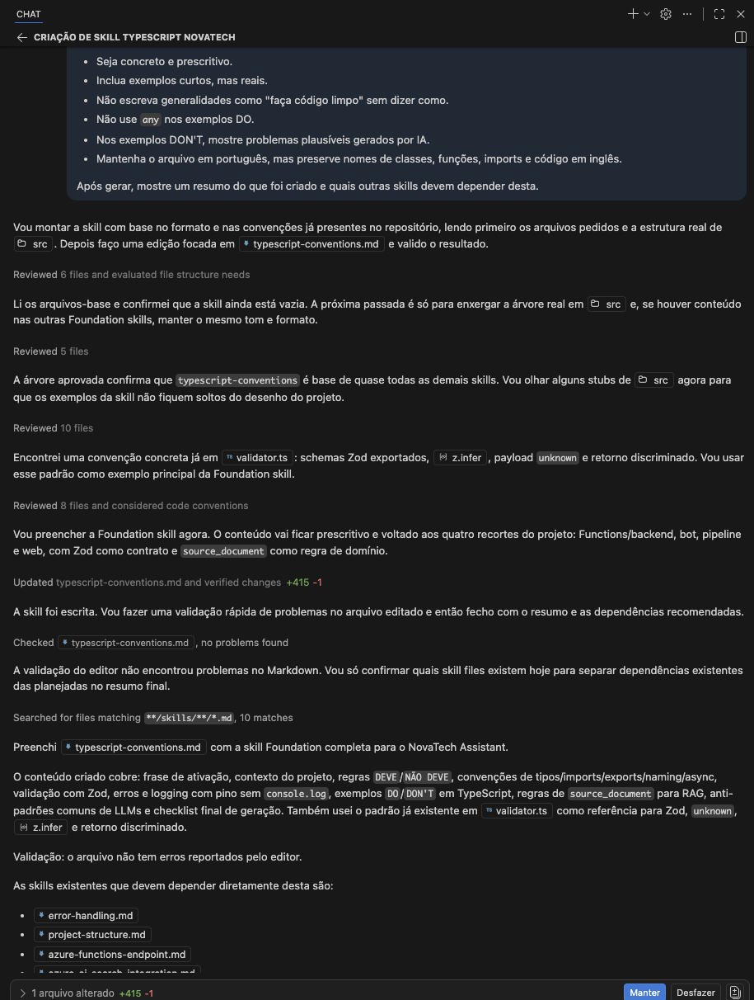

# Evidência 03 — Prompt Copilot para gerar skill Foundation

## Identificação

- Exercício: Desenvolvedor 2.3 — Definição de estratégia de skills do projeto
- Artefato: Prompt usado no GitHub Copilot para criar a skill Foundation principal
- Ferramenta usada: GitHub Copilot
- Skill escolhida: `typescript-conventions.md`
- Evidência associada: 

## Justificativa da skill escolhida

`typescript-conventions.md` foi escolhida como Foundation principal porque será consumida por todas as outras skills técnicas do projeto: endpoints Azure Functions, integrações Azure AI Search, testes Vitest, pipeline de ingestão, bot e componentes React. Sem essa base, o Copilot tende a gerar `any`, contratos implícitos, payload sem schema, imports inconsistentes e logging via `console.log`.

## Prompt utilizado

```text
Crie o conteúdo completo da skill Foundation `skills/foundation/typescript-conventions.md` para o projeto NovaTech Assistant.

Antes de escrever, leia:
- `AGENTS.md`
- `package.json`
- `tsconfig.json`
- estrutura de `src/`
- `skills/foundation/`
- `specs/query-endpoint/plan.md` se existir conteúdo

Contexto da skill:
- Esta skill deve orientar agentes a gerar TypeScript consistente para backend, bot, pipeline e web.
- O projeto usa TypeScript strict, Zod para contratos, Vitest para testes, pino para logging e módulos ES.
- O domínio é RAG/logística NovaTech; respostas do assistente precisam carregar fonte (`source_document`) e evitar valores inventados.

Conteúdo obrigatório do arquivo:
1. Título e frase de ativação: quando usar esta skill.
2. Contexto do projeto.
3. Regras prescritivas com DEVE/NÃO DEVE.
4. Convenções de tipos, imports, exports, naming e async.
5. Regras para validação com Zod.
6. Regras para erros e logging sem `console.log`.
7. Exemplos DO/DON'T com código TypeScript real.
8. Anti-padrões que LLMs costumam gerar neste projeto.
9. Checklist antes de finalizar uma geração de código.

Regras de escrita:
- Seja concreto e prescritivo.
- Inclua exemplos curtos, mas reais.
- Não escreva generalidades como "faça código limpo" sem dizer como.
- Não use `any` nos exemplos DO.
- Nos exemplos DON'T, mostre problemas plausíveis gerados por IA.
- Mantenha o arquivo em português, mas preserve nomes de classes, funções, imports e código em inglês.

Após gerar, mostre um resumo do que foi criado e quais outras skills devem depender desta.
```

## Output bruto do Copilot

```markdown
Vou montar a skill com base no formato e nas convenções já presentes no repositório, lendo primeiro os arquivos pedidos e a estrutura real de src. Depois faço uma edição focada em typescript-conventions.md e valido o resultado.

Read [](file:///Users/fernanda.peron/Documents/repositories/dgs-ai-first/src)

Read [](file:///Users/fernanda.peron/Documents/repositories/dgs-ai-first/pratica-2/anexo-c-estrutura-repositorio.md)

Read [](file:///Users/fernanda.peron/Documents/repositories/dgs-ai-first/skills/foundation/typescript-conventions.md)

Read [](file:///Users/fernanda.peron/Documents/repositories/dgs-ai-first/package.json)

Read [](file:///Users/fernanda.peron/Documents/repositories/dgs-ai-first/tsconfig.json)

Read [](file:///Users/fernanda.peron/Documents/repositories/dgs-ai-first/exercicio-2.3/01-arvore-skills.md#1-1), lines 1 to 260

Li os arquivos-base e confirmei que a skill ainda está vazia. A próxima passada é só para enxergar a árvore real em src e, se houver conteúdo nas outras Foundation skills, manter o mesmo tom e formato.

Searched for files matching `**/src/**`, 23 matches

Read [](file:///Users/fernanda.peron/Documents/repositories/dgs-ai-first/skills/foundation/error-handling.md)

Read [](file:///Users/fernanda.peron/Documents/repositories/dgs-ai-first/skills/foundation/project-structure.md)

Read [](file:///Users/fernanda.peron/Documents/repositories/dgs-ai-first/vitest.config.ts)

Read [](file:///Users/fernanda.peron/Documents/repositories/dgs-ai-first/README.md)

A árvore aprovada confirma que `typescript-conventions` é base de quase todas as demais skills. Vou olhar alguns stubs de src agora para que os exemplos da skill não fiquem soltos do desenho do projeto.

Read [](file:///Users/fernanda.peron/Documents/repositories/dgs-ai-first/src/shared/types.ts)

Read [](file:///Users/fernanda.peron/Documents/repositories/dgs-ai-first/src/shared/config.ts)

Read [](file:///Users/fernanda.peron/Documents/repositories/dgs-ai-first/src/shared/logger.ts)

Read [](file:///Users/fernanda.peron/Documents/repositories/dgs-ai-first/src/shared/errors.ts)

Read [](file:///Users/fernanda.peron/Documents/repositories/dgs-ai-first/src/functions/query/validator.ts)

Read [](file:///Users/fernanda.peron/Documents/repositories/dgs-ai-first/src/functions/query/response-builder.ts)

Read [](file:///Users/fernanda.peron/Documents/repositories/dgs-ai-first/src/services/prompt-builder.ts)

Read [](file:///Users/fernanda.peron/Documents/repositories/dgs-ai-first/src/services/search.ts)

Read [](file:///Users/fernanda.peron/Documents/repositories/dgs-ai-first/src/services/response-validator.ts)

Read [](file:///Users/fernanda.peron/Documents/repositories/dgs-ai-first/src/web/src/App.tsx)

Encontrei uma convenção concreta já em validator.ts: schemas Zod exportados, `z.infer`, payload `unknown` e retorno discriminado. Vou usar esse padrão como exemplo principal da Foundation skill.

Read [](file:///Users/fernanda.peron/Documents/repositories/dgs-ai-first/src/functions/feedback/validator.ts)

Read [](file:///Users/fernanda.peron/Documents/repositories/dgs-ai-first/src/functions/feedback/handler.ts)

Read [](file:///Users/fernanda.peron/Documents/repositories/dgs-ai-first/src/functions/health/handler.ts)

Read [](file:///Users/fernanda.peron/Documents/repositories/dgs-ai-first/src/functions/query/handler.ts)

Read [](file:///Users/fernanda.peron/Documents/repositories/dgs-ai-first/src/bot/bot.ts)

Read [](file:///Users/fernanda.peron/Documents/repositories/dgs-ai-first/src/pipeline/chunker.ts)

Read [](file:///Users/fernanda.peron/Documents/repositories/dgs-ai-first/src/pipeline/extractor.ts)

Read [](file:///Users/fernanda.peron/Documents/repositories/dgs-ai-first/src/bot/cards/response-card.ts)

Vou preencher a Foundation skill agora. O conteúdo vai ficar prescritivo e voltado aos quatro recortes do projeto: Functions/backend, bot, pipeline e web, com Zod como contrato e `source_document` como regra de domínio.

Generating patch (418 lines) in [](file:///Users/fernanda.peron/Documents/repositories/dgs-ai-first/skills/foundation/typescript-conventions.md)


A skill foi escrita. Vou fazer uma validação rápida de problemas no arquivo editado e então fecho com o resumo e as dependências recomendadas.

Checked [](file:///Users/fernanda.peron/Documents/repositories/dgs-ai-first/skills/foundation/typescript-conventions.md), no problems found

A validação do editor não encontrou problemas no Markdown. Vou só confirmar quais skill files existem hoje para separar dependências existentes das planejadas no resumo final.

Searched for files matching `**/skills/**/*.md`, 10 matches

Preenchi typescript-conventions.md com a skill Foundation completa para o NovaTech Assistant.

O conteúdo criado cobre: frase de ativação, contexto do projeto, regras `DEVE`/`NÃO DEVE`, convenções de tipos/imports/exports/naming/async, validação com Zod, erros e logging com pino sem `console.log`, exemplos `DO`/`DON'T` em TypeScript, regras de `source_document` para RAG, anti-padrões comuns de LLMs e checklist final de geração. Também usei o padrão já existente em validator.ts como referência para Zod, `unknown`, `z.infer` e retorno discriminado.

Validação: o arquivo não tem erros reportados pelo editor.

As skills existentes que devem depender diretamente desta são:

- error-handling.md
- project-structure.md
- azure-functions-endpoint.md
- azure-ai-search-integration.md
- react-components.md
- testing-patterns.md
- create-rag-endpoint.md
- create-integration-test.md
- create-react-card.md

E, pela árvore aprovada, as skills planejadas `azure-openai-integration`, `rag-pipeline` e `create-technical-doc` também devem consumir esta Foundation quando forem criadas.

Fez alterações.
```

## Arquivo gerado/alterado

- `skills/foundation/typescript-conventions.md`

## Checklist

- [x] O prompt pediu leitura dos arquivos de contexto necessários.
- [x] O prompt indicou o arquivo exato a criar/alterar.
- [x] O prompt exigiu regras prescritivas, exemplos DO/DON'T e anti-padrões.
- [x] O prompt proibiu `any` nos exemplos DO.
- [x] O prompt conectou TypeScript strict, Zod, Vitest, pino e `source_document`.
- [x] O output bruto do Copilot foi registrado.
